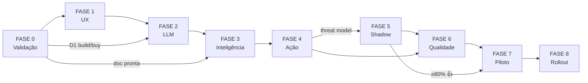

# MASTER 03 — Plano Integrado de Execução

> Plano único integrando: arquitetura técnica, versões do produto (v0–v7), milestones, gates de qualidade, dependências entre fases e critérios de progressão. **Substitui o conteúdo de planejamento dos docs anteriores.**

---

## 1. Princípios do plano

1. **Toda fase tem gate.** Sem aprovar gate, não avança.
2. **Gates dependem de evidência mensurada, não de "está pronto".**
3. **Atraso não muda escopo, muda fase final.** Não se corta qualidade pra cumprir prazo.
4. **Cada fase entrega valor isolado.** Se projeto morrer no meio, o que foi feito ainda serve.
5. **Sem decisão D1–D7 do `MASTER_01` resolvida, fase 0 não termina.**

---

## 2. Visão macro — fases vs versões

```
FASE 0 — VALIDAÇÃO          FASE 1 — UX          FASE 2 — INFRA E LLM
(2–4 semanas)               (2 semanas)          (1–2 semanas)
0 código                    v0 + v1              v2
                                ▼                    ▼
                            ┌─────────┐          ┌─────────┐
                            │ GATE A  │          │ GATE B  │
                            │ UX OK?  │          │ Bedrock │
                            └─────────┘          │  OK?    │
                                                 └─────────┘

FASE 3 — INTELIGÊNCIA       FASE 4 — AÇÃO        FASE 5 — PROATIVIDADE
(2–3 semanas)               (2 semanas)          (2 semanas)
v3                          v4                   v5 (shadow)
    ▼                           ▼                    ▼
┌─────────┐                 ┌─────────┐          ┌─────────┐
│ GATE C  │                 │ GATE D  │          │ GATE E  │
│ RAG     │                 │ Tools   │          │ Shadow  │
│ qualid. │                 │ seguras │          │ ≥80% OK │
└─────────┘                 └─────────┘          └─────────┘

FASE 6 — QUALIDADE          FASE 7 — PILOTO      FASE 8 — ROLLOUT
(2 semanas)                 (4 semanas)          (contínuo)
v6                          5 usuários           v6 escala
    ▼                           ▼                    ▼
┌─────────┐                 ┌─────────┐          ┌─────────┐
│ GATE F  │                 │ GATE G  │          │ Métricas│
│ Eval +  │                 │ Adoção  │          │ contín. │
│ obs.    │                 │  > 40%  │          │         │
└─────────┘                 └─────────┘          └─────────┘
```

**Tempo total honesto:** 5–7 meses até produção com 5 usuários piloto. Mais 2–3 meses até 50 usuários.

---

## 3. FASE 0 — Validação (2–4 semanas, 0 código)

### 3.1 Objetivo
Responder as 10 decisões críticas (`MASTER_01` §9) com evidência. Decidir build vs buy vs híbrido.

### 3.2 Atividades

| # | Atividade | Dono | Output |
|---|---|---|---|
| 0.1 | Auditar documentação interna existente | PO + Tech Lead | Score de cobertura (% das 20 perguntas-teste com resposta textual) |
| 0.2 | Diário de tempo da operação (1 semana) | PO + 5 colaboradores | Tabela: tarefa × tempo médio diário |
| 0.3 | POC de injeção do widget no sistema atual | Tech Lead | Confirmado/recusado |
| 0.4 | Verificar Bedrock liberado na região | Tech Lead | Console screenshot |
| 0.5 | Conversa com DPO + RIPD inicial | PO + DPO | RIPD draft |
| 0.6 | Comparativo build vs buy formal | Tech Lead | Documento de 2 páginas com prós/contras de Glean / Intercom Fin / Custom |
| 0.7 | Definir patrocinador e formalizar dedicação do PO | Tech Lead → Patrocinador | Email/portaria assinada |
| 0.8 | Aprovar orçamento de 12 meses | Patrocinador | Aprovação formal |

### 3.3 🚦 GATE 0 — Critérios de progressão

Para liberar Fase 1, **todos** os critérios devem estar verdes:

- [ ] Cobertura de documentação ≥ 70% nas 20 perguntas-teste (ou plano formal pra criar nas próximas 4 semanas).
- [ ] Diário de tempo confirmou ≥ 15 min/dia em tarefas-alvo.
- [ ] Decisão D1 (build/buy/híbrido) tomada e documentada.
- [ ] Patrocinador formalizado com nome e email.
- [ ] PO formalizado com 8h/sem liberadas pelo gestor original.
- [ ] DPO ciente, RIPD em andamento.
- [ ] Bedrock acessível e modelos liberados.
- [ ] Orçamento de 12 meses aprovado.

**Se < 6/8:** repete fase, não avança.
**Se 6–7/8:** avança com plano de mitigação para os faltantes.
**Se 8/8:** avança com confiança.

---

## 4. FASE 1 — UX e prova de conceito (2 semanas)

### 4.1 Objetivo
Construir v0 + v1 (mock totalmente funcional, sem backend) e validar UX com usuários reais.

### 4.2 Sub-fase 1A — v0 (3 dias)
- Componente da bolinha visual.
- Painel de chat abrindo/fechando.
- Layout estático.
- **Entregável:** demo navegável, 0 interatividade.

### 4.3 Sub-fase 1B — v1 (5–7 dias)
- Animações profissionais (typing indicator, streaming fake, transições).
- 15–20 fluxos mocados em JSON.
- 4 cenários completos: Q&A, geração de Excel, envio de mensagem, sugestão proativa.
- Botão "falar com humano".
- Personalidade definida (nome, avatar, tom).
- **Entregável:** demo deployado em URL pública (Vercel/Netlify).

### 4.4 Sub-fase 1C — Validação UX (3–5 dias)
- 5 sessões de teste de usuário com colaboradores da operação.
- Roteiro semi-estruturado: 4 tarefas + perguntas abertas.
- Coleta: NPS, % tarefa concluída, lista de fluxos pedidos não cobertos.
- **Entregável:** relatório de 3 páginas com top 10 aprendizados.

### 4.5 🚦 GATE A — Critérios de progressão

- [ ] 5/5 usuários conseguiram completar tarefa simples (Q&A) sem instrução.
- [ ] 4/5 usuários disseram "usaria isso no dia a dia" (não-vinculante mas indicativo).
- [ ] Lista de ≥ 15 perguntas reais coletadas → backlog v3.
- [ ] Lista de ≥ 5 ações pedidas → backlog v4.
- [ ] Tech Lead confirma que widget pode ser embutido no sistema sem bloqueios.

**Se falhar:** revisar UX, refazer mock, retestar. **Não avançar pra v2.**

---

## 5. FASE 2 — Infra e LLM real (1–2 semanas)

### 5.1 Objetivo
Trocar mock por Bedrock real, mantendo a UX da v1.

### 5.2 Atividades técnicas

| # | Item | Estimativa |
|---|---|---|
| 2.1 | Setup conta AWS + IAM + CDK boilerplate | 1 dia |
| 2.2 | Lambda Orchestrator + integração Bedrock Haiku 4.5 | 2 dias |
| 2.3 | API Gateway REST + endpoint de chat com SSE | 1 dia |
| 2.4 | DynamoDB sessões + persistência | 1 dia |
| 2.5 | Auth via JWT do sistema atual | 1–2 dias |
| 2.6 | Substituição do mock no widget pelo backend real | 1 dia |
| 2.7 | Logs CloudWatch + métricas básicas | 1 dia |
| 2.8 | Pipeline CI/CD (GitHub Actions → CodePipeline) | 1 dia |

### 5.3 🚦 GATE B — Critérios de progressão

- [ ] Bot responde perguntas genéricas com latência p95 < 4s (primeiro token).
- [ ] Auth bloqueia request sem JWT válido.
- [ ] Logs estruturados em CloudWatch, custo do dia visível em dashboard.
- [ ] Deploy automatizado (1 comando ou push em branch protegida).
- [ ] DynamoDB armazena histórico corretamente, com TTL.
- [ ] Streaming SSE funciona end-to-end no widget.

---

## 6. FASE 3 — Inteligência (2–3 semanas)

### 6.1 Objetivo
Bot conhece as regras da empresa e segue playbooks.

### 6.2 Atividades

| # | Item | Estimativa |
|---|---|---|
| 3.1 | Curadoria final da documentação (PO) | 3–5 dias |
| 3.2 | Bucket S3 + Bedrock Knowledge Base configurada | 1 dia |
| 3.3 | Tool `consultar_conhecimento` integrada via tool use | 2 dias |
| 3.4 | Engine de execução de playbook YAML | 3–4 dias |
| 3.5 | Escrever 3 playbooks iniciais (cobrança, cadastro, baixa) | 3 dias (PO + Tech Lead) |
| 3.6 | Upgrade pra Sonnet 4.6 + classificação por Haiku | 1 dia |
| 3.7 | Citação de fonte em respostas | 1 dia |
| 3.8 | Testes de regressão manual (50 perguntas) | 2 dias |

### 6.3 🚦 GATE C — Critérios de progressão

- [ ] PO aprova qualidade em 40/50 perguntas-teste (taxa ≥ 80%).
- [ ] Bot cita fonte em 100% das respostas factuais.
- [ ] Bot recusa adequadamente perguntas fora de escopo.
- [ ] 3 playbooks executam ponta-a-ponta sem alucinação.
- [ ] Latência p95 mantida < 5s mesmo com RAG.

**Se falhar:** raiz comum é doc ruim. Voltar pra curadoria, **não tentar truques de prompt**.

---

## 7. FASE 4 — Ação (2 semanas)

### 7.1 Objetivo
Bot executa tarefas reais com confirmação humana e auditoria.

### 7.2 Atividades

| # | Item | Estimativa |
|---|---|---|
| 4.1 | Lambda `get_cliente_info` (lê RDS via réplica) | 2 dias |
| 4.2 | Lambda `gerar_excel` (gera + S3 + URL pré-assinada) | 2 dias |
| 4.3 | Lambda `enviar_email` (SES sandbox) | 2 dias |
| 4.4 | Lambda `abrir_tela` (devolve deep link) | 1 dia |
| 4.5 | Fluxo de confirmação humana com cards no widget | 3 dias |
| 4.6 | Idempotency keys + retry logic | 1 dia |
| 4.7 | Tabela `audit_log` no RDS + escrita em todas tools | 2 dias |
| 4.8 | Validação de permissão por tool (mapeamento role × tool) | 2 dias |
| 4.9 | Testes de tool em staging com dados reais (mascarados) | 2 dias |

### 7.3 🚦 GATE D — Critérios de progressão

- [ ] 100% das tools com confirmação humana antes de executar.
- [ ] 100% das tools logadas em `audit_log`.
- [ ] Validação de permissão funciona (role X não dispara tool Y).
- [ ] Idempotency testada (chamar 2x mesma tool não gera 2 ações).
- [ ] Threat model revisado por Segurança, sem severidades altas abertas.
- [ ] Email de teste enviado e recebido em sandbox.

---

## 8. FASE 5 — Proatividade em modo shadow (2 semanas + 2 de operação shadow)

### 8.1 Objetivo
Bot gera sugestões proativas, mas só humano vê. Validar qualidade antes de expor.

### 8.2 Atividades

| # | Item | Estimativa |
|---|---|---|
| 5.1 | EventBridge Scheduler + Lambda Scanner | 2 dias |
| 5.2 | 3 regras determinísticas em SQL | 2 dias (PO + dev) |
| 5.3 | Lambda Suggestion Generator (Haiku formula mensagem) | 2 dias |
| 5.4 | DynamoDB `proactive_suggestions` com TTL | 1 dia |
| 5.5 | Dashboard interno de revisão (tela admin simples) | 3 dias |
| 5.6 | Endpoint `GET /suggestions` + polling no widget (oculto em shadow) | 1 dia |
| 5.7 | **2 semanas de operação em shadow** com PO revisando | 10 dias |

### 8.3 🚦 GATE E — Critérios de progressão

- [ ] PO revisou ≥ 100 sugestões geradas.
- [ ] ≥ 80% marcadas como 👍 ("teria sido útil").
- [ ] ≤ 5% marcadas como 👎 ("teria gerado problema").
- [ ] Nenhuma sugestão revelou dado sensível indevidamente.
- [ ] Custo médio por sugestão < R$ 0,05.

**Se < 80% 👍:** ajustar regras determinísticas (não prompt), repetir 1 semana.
**Se ≥ 5% 👎:** fase trava. Investigar causa-raiz com PO.

---

## 9. FASE 6 — Qualidade e observabilidade (2 semanas)

### 9.1 Objetivo
Tudo medido, evals automatizados, fallbacks testados.

### 9.2 Atividades

| # | Item | Estimativa |
|---|---|---|
| 6.1 | Dataset de eval (100+ casos) + rotulagem | 4 dias (PO + especialista) |
| 6.2 | Pipeline de eval em GitHub Actions com LLM-as-judge | 3 dias |
| 6.3 | Bloqueio de merge por queda de score | 1 dia |
| 6.4 | Botões 👍/👎 + persistência | 1 dia |
| 6.5 | Dashboard CloudWatch com métricas-chave | 2 dias |
| 6.6 | Bedrock Guardrails ativados (PII, prompt injection) | 1 dia |
| 6.7 | Rate limit por usuário | 1 dia |
| 6.8 | Fallback gracioso quando Bedrock indisponível | 1 dia |
| 6.9 | Botão "falar com humano" abrindo ticket | 2 dias |
| 6.10 | Onboarding in-app (tour 30s) | 1 dia |
| 6.11 | Runbooks de incidente | 2 dias |
| 6.12 | Pen test (interno ou terceirizado) | 5 dias |

### 9.3 🚦 GATE F — Critérios de progressão

- [ ] Eval suite roda em < 10 min, score baseline ≥ 85%.
- [ ] Bedrock Guardrails bloqueia 100% dos casos de teste de PII.
- [ ] Fallback testado: bot oferece "falar com humano" quando Bedrock falha.
- [ ] Pen test sem severidades altas abertas.
- [ ] Runbooks aprovados por Tech Lead + Patrocinador.
- [ ] Custo por usuário/dia < R$ 1,00 em teste.

---

## 10. FASE 7 — Piloto controlado (4 semanas)

### 10.1 Objetivo
5 usuários reais usando o bot **com dados reais**, com observação intensa.

### 10.2 Setup
- Lista nomeada de 5 usuários piloto (mix de perfis: junior, sênior, gestor).
- Termo de uso assinado (mesmo interno).
- Canal Slack `#copiloto-piloto` para feedback.
- PO + Tech Lead respondem feedback em < 24h.
- Modo shadow continua rodando em paralelo (sugestões já liberadas para esses 5).

### 10.3 Atividades semanais
- Sex: review com os 5 usuários (30 min em grupo).
- Sex: ajustes priorizados na próxima sprint.
- Atualização semanal pro Patrocinador.

### 10.4 🚦 GATE G — Critérios de progressão (após 4 semanas)

- [ ] Adoção: 4/5 usuários ativos pelo menos 3x/semana.
- [ ] Profundidade: média ≥ 5 mensagens/usuário/semana.
- [ ] Tarefa concluída: ≥ 60% das conversas resultaram em ação ou Q&A satisfatório.
- [ ] Sugestões proativas: ≥ 15% das exibidas viraram clique.
- [ ] NPS ≥ 30 (escala -100 a +100).
- [ ] Zero incidentes SEV1.
- [ ] ≤ 2 incidentes SEV2 totais.
- [ ] PO recomenda expansão (carta formal).

**Se falhar:** entender causa raiz. Nem todo "fracasso" é fim — pode indicar que escopo errado, e novo escopo deve ser tentado por +4 semanas.

---

## 11. FASE 8 — Rollout escalonado (contínuo)

### 11.1 Crescimento sugerido

| Semana | Usuários | Atividade especial |
|---|---|---|
| 1–2 | 5 (piloto) | Já em GATE G |
| 3–4 | 15 | Onboarding em grupo |
| 5–8 | 30 | Coleta de feedback amplo |
| 9–12 | 50 | Apresentação de KPIs ao Patrocinador |
| 13+ | 100+ | Conforme demanda |

### 11.2 Gatilhos para pausar rollout
- Custo AWS > 1.5x baseline.
- Adoção semanal cai > 20% em coorte nova.
- ≥ 3 incidentes SEV2 em 2 semanas.
- Feedback negativo agregado > 25%.

---

## 12. Stack técnica final consolidada (sem mudanças vs MASTER docs anteriores)

| Camada | Escolha | Custo aproximado/mês | Quando entra |
|---|---|---|---|
| LLM | Bedrock Sonnet 4.6 + Haiku 4.5 | US$ 200–500 | v2 |
| RAG | Bedrock Knowledge Base + OpenSearch Serverless | US$ 700+ | v3 |
| Compute | Lambda (Node.js ou Python) | US$ 30 | v2 |
| API | API Gateway REST + SSE | US$ 20 | v2 |
| Banco sessão | DynamoDB on-demand | US$ 30 | v2 |
| Banco negócio | RDS existente (réplica) | $0 (já existe) | v4 |
| Artefatos | S3 + URL pré-assinada | US$ 10 | v4 |
| Email | SES | US$ 5 | v4 |
| WhatsApp | Twilio (BSP) | US$ 0,01/msg | v7 |
| Agendamento | EventBridge Scheduler | US$ 1 | v5 |
| Observabilidade | CloudWatch + X-Ray | US$ 30 | v2 |
| Guardrails | Bedrock Guardrails | US$ 20 | v6 |
| Segredos | Secrets Manager | US$ 5 | v2 |
| IaC | AWS CDK (TypeScript) | $0 | v2 |
| CI/CD | GitHub Actions + CodePipeline | $0 | v2 |
| Staging | espelho de tudo acima (50% do custo) | +US$ 500 | v3 |

**Custo realista total em produção (50 usuários, com staging):** US$ 1.800–2.500/mês ≈ **R$ 11–15k/mês**.

---

## 13. Cronograma consolidado

```
Mês 1  │ FASE 0: Validação (4 semanas)
Mês 2  │ FASE 1: UX (2 semanas) + FASE 2: Infra (2 semanas)
Mês 3  │ FASE 3: Inteligência (3 semanas) + início FASE 4
Mês 4  │ FASE 4: Ação (final) + FASE 5: Proatividade shadow
Mês 5  │ FASE 5 (operação shadow) + FASE 6: Qualidade
Mês 6  │ FASE 6 (final) + FASE 7: Piloto (início)
Mês 7  │ FASE 7: Piloto (operação 4 semanas)
Mês 8+ │ FASE 8: Rollout escalonado
```

**Total:** ~7 meses até 5 usuários piloto. ~9–10 meses até 50 usuários estáveis.

---

## 14. Dependências críticas entre fases



---

## 15. Checklist enxuto pra começar amanhã

Se tudo o que está acima for muito, esta é a versão minimalista do "primeiro mês":

- [ ] Marcar reunião de 60 min com Patrocinador (alinhar D4, D7).
- [ ] Pegar 20 perguntas reais da operação e testar contra documentação atual.
- [ ] Conversar com 1 colaborador candidato a PO sobre dedicar 8h/sem.
- [ ] Email pro DPO descrevendo o projeto.
- [ ] Pedir liberação de Bedrock na conta AWS (1–2 dias).
- [ ] Decidir se fala com Glean/Intercom para cotação comparativa.
- [ ] Bloquear 3 dias na agenda pra construir v0.

Se em 2 semanas você fez essas 7 coisas → está no ritmo. Se não, o projeto não vai sair do papel mesmo.
