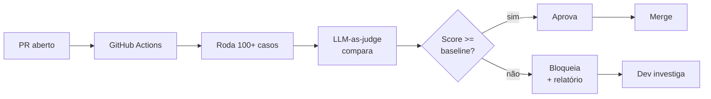

# MASTER 04 — Validação, Verificação e Critérios de Sucesso

> Como provar que cada fase deu certo. Quais métricas coletar, como coletar, qual é o "passou", qual é o "falhou", e quando é hora de matar o projeto. **Sem validação rigorosa, IA generativa interna sempre "parece" estar funcionando.**

---

## 1. Filosofia de validação

1. **Métrica antes de promessa.** Não diga "vai economizar tempo" — meça "quanto tempo a tarefa X leva hoje" antes do bot existir.
2. **Coleta baseline antes de qualquer fase.** Sem baseline, qualquer melhoria é placebo.
3. **Distinção rigorosa entre 3 tipos de qualidade:**
   - **Técnica** (latência, uptime, custo) → fácil de medir.
   - **De resposta** (resposta está certa? cita fonte? não alucina?) → exige eval suite.
   - **De produto** (gerou valor pro usuário? mudou comportamento?) → exige instrumentação + entrevista.
3. **Validação é função do PO + Tech Lead em conjunto.** Não é só QA, não é só engenharia.
4. **Kill switch existe.** Se métricas não atingem patamar, projeto pode ser pausado ou encerrado. Decidir isso **antes** evita escalar viés de comprometimento.

---

## 2. Métricas por categoria

### 2.1 Métricas técnicas (saúde do sistema)

| Métrica | Definição | Meta | Alerta |
|---|---|---|---|
| Latência primeiro token (p50) | Tempo entre request e primeiro byte de resposta | < 1.5s | > 2.5s |
| Latência primeiro token (p95) | Idem, percentil 95 | < 4s | > 6s |
| Latência resposta completa (p50) | Tempo até última palavra | < 6s | > 10s |
| Uptime API | % de requests com 2xx | > 99.5% | < 99% |
| Taxa de erro de tool | Tool calls com falha / total | < 2% | > 5% |
| Custo médio por interação | Custo Bedrock / nº interações | < R$ 0,10 | > R$ 0,25 |
| Custo total mensal | Soma AWS + 3rd party | < orçamento | > 110% orçamento |
| Cold start de Lambda | % requests com cold start | < 5% | > 15% |

**Onde:** CloudWatch + dashboard custom.
**Frequência:** real-time, alarmes via SNS.
**Responsável:** Tech Lead.

### 2.2 Métricas de qualidade de resposta

| Métrica | Definição | Meta inicial | Meta madura |
|---|---|---|---|
| Score de eval suite | % de casos rotulados que passaram | > 80% | > 92% |
| Taxa de alucinação | Respostas factuais não fundamentadas em RAG (sample manual) | < 10% | < 3% |
| Taxa de citação | % respostas factuais com fonte citada | > 90% | > 99% |
| Taxa de recusa correta | % perguntas fora-de-escopo recusadas adequadamente | > 80% | > 95% |
| Taxa de tool correta | % vezes que LLM chama a tool certa | > 85% | > 95% |

**Onde:** pipeline de eval em CI + sampling manual semanal.
**Frequência:** a cada PR + amostra semanal de 30 conversas.
**Responsável:** PO + Tech Lead (eval), PO (sampling).

### 2.3 Métricas de produto (valor real)

| Métrica | Definição | Meta 3m | Meta 12m |
|---|---|---|---|
| Adoção semanal | % usuários ativos ≥ 1x na semana | > 40% | > 70% |
| Profundidade | Mensagens/usuário ativo/semana | > 5 | > 15 |
| Stickiness | DAU/WAU | > 0.4 | > 0.6 |
| Retenção 4 semanas | % usuários que iniciaram e ainda usam | > 50% | > 75% |
| Taxa de tarefa concluída | % conversas com resultado útil (auto-relato) | > 60% | > 85% |
| Taxa de feedback positivo | 👍 / (👍+👎) | > 75% | > 90% |
| Tempo economizado por tarefa | Δ (tempo manual − tempo com bot) | ≥ 30% | ≥ 60% |
| % sugestões proativas → ação | clicada / exibida | > 15% | > 30% |
| NPS do bot | "Indicaria a colega novo?" (-100 a +100) | > 30 | > 50 |
| Custo por interação útil | Custo / (interações × taxa tarefa concluída) | < R$ 0,30 | < R$ 0,10 |

**Onde:** instrumentação no widget + DynamoDB + entrevistas mensais.
**Frequência:** dashboard semanal, deep-dive mensal, entrevistas trimestrais.
**Responsável:** PO.

### 2.4 Métricas organizacionais (saúde do projeto)

Listadas no `MASTER_02 §10`. Não repetir aqui, mas **revisar mensalmente** junto com as outras.

---

## 3. Métodos de coleta

### 3.1 Instrumentação no widget

Eventos a emitir (toda ação do usuário deve gerar log):

```typescript
trackEvent('chat_opened', { screen, userId });
trackEvent('message_sent', { length, screen });
trackEvent('message_received', { latency_ms, has_tool_call, model });
trackEvent('tool_invoked', { tool, success, latency_ms });
trackEvent('feedback_given', { messageId, rating, comment });
trackEvent('suggestion_shown', { suggestionId, type });
trackEvent('suggestion_clicked', { suggestionId, action });
trackEvent('suggestion_dismissed', { suggestionId, reason });
trackEvent('handoff_to_human', { reason });
trackEvent('chat_closed', { duration, message_count });
```

**Destino:** CloudWatch Logs Insights ou tabela DynamoDB de eventos com TTL de 90 dias.

### 3.2 Pipeline de eval (qualidade de resposta)

**Estrutura do dataset:**

```yaml
# evals/dataset/cobranca_001.yaml
id: cobranca_001
categoria: cobranca
input:
  pergunta: "Como cobro um cliente que não pagou a mensalidade?"
  contexto: { userId: "test_user", role: "atendente" }
gabarito:
  deve_citar: ["manual_financeiro_v3", "secao_4_cobranca"]
  deve_chamar_tool: null
  deve_conter: ["registrar_pagamento", "fatura"]
  nao_deve_conter: ["api_rest", "deploy"]  # detector de alucinação
  resposta_modelo: |
    Pra cobrar um cliente em atraso, vai em Financeiro → Faturas, abre a fatura
    em aberto e clica em "Enviar Cobrança". Posso fazer isso por você se quiser.
```

**Pipeline:**



**LLM-as-judge prompt (template):**

```
Você é um avaliador. Comparado ao gabarito abaixo, a resposta do bot está:
- correta (mesmo significado, citou fonte certa)
- parcialmente correta (faltou algo importante)
- incorreta (alucinação ou erro grave)

GABARITO: {gabarito.resposta_modelo}
DEVE CITAR: {gabarito.deve_citar}
DEVE CONTER: {gabarito.deve_conter}
NÃO DEVE CONTER: {gabarito.nao_deve_conter}

RESPOSTA DO BOT: {output}

Responda em JSON: {"verdict": "correta|parcial|incorreta", "razao": "..."}
```

**Critério:** score = (correta + 0.5 × parcial) / total. Baseline trava merge.

### 3.3 Sampling manual (verificação de eval)

Eval automatizada confia no LLM-as-judge. Mas o juiz também pode errar. Por isso:

- Toda semana, **PO revisa 20 conversas reais aleatórias** (com PII mascarado).
- Marca cada uma: 👍 / 👎 / 🤔.
- Compara com o que o feedback do usuário disse e o que o LLM-judge teria dito.
- Discrepância > 15% → recalibra eval suite.

### 3.4 Diário de tempo (validação de ROI)

Para validar a métrica "tempo economizado":

**Antes do bot (Fase 0):**
- 5 colaboradores fazem diário de 1 semana: tarefa × tempo gasto.
- Calcula tempo médio por tarefa-alvo.

**Depois do bot (após v6, 4 semanas em piloto):**
- Mesmos 5 colaboradores, mesma metodologia.
- Compara.
- Diferença é o "tempo economizado" — agora com dado, não chute.

**Cuidado:** novidade gera viés positivo. Repetir medição em 3 meses pra ver se persiste.

### 3.5 Entrevistas qualitativas

**Mensais:** PO conversa com 3 usuários por 30 min cada.
- O que está usando?
- O que tentou e não funcionou?
- Que ação queria ter mas não tem?
- Confiaria no bot pra tarefa X? Por que sim/não?

**Output:** notas estruturadas no Notion, padronizadas, indexáveis.

---

## 4. Gates de validação por fase (consolidado do MASTER_03)

| Gate | Fase | O que valida | Métrica chave | Limite |
|---|---|---|---|---|
| GATE 0 | Pré-código | Premissas críticas | Score 8 itens | ≥ 6/8 |
| GATE A | Pós-v1 | UX funciona | Tarefa concluída em teste | 5/5 sem instrução |
| GATE B | Pós-v2 | Infra + LLM básico | Latência p95 | < 4s |
| GATE C | Pós-v3 | RAG + playbooks | Qualidade resposta (PO) | ≥ 80% |
| GATE D | Pós-v4 | Tools seguras | Threat model | sem severidade alta |
| GATE E | Pós-shadow | Proatividade | Aprovação PO | ≥ 80% 👍, ≤ 5% 👎 |
| GATE F | Pós-v6 | Qualidade prod | Eval score + pen test | ≥ 85% + sem severidade alta |
| GATE G | Pós-piloto | Adoção real | Adoção 4/5 + NPS | ≥ 80% adoção, NPS ≥ 30 |

---

## 5. Critérios de Kill Switch

> Decisões duras que devem ser combinadas **antes** de começar. Sem isso, projeto sempre vai "estar quase lá".

### 5.1 Kill switch técnico (decisão do Tech Lead)

Desligar bot temporariamente se:
- Bedrock indisponível por > 30 min e fallback não está funcionando.
- Custo do dia > 5x baseline.
- Vazamento de dados confirmado.
- Tool gerando ações erradas em produção (≥ 3 ocorrências confirmadas).

**Ação:** desabilitar via feature flag, comunicar usuários, postmortem em 48h.

### 5.2 Kill switch de produto (decisão do PO + Patrocinador)

Pausar fase atual e reavaliar se:
- GATE falha 2 vezes consecutivas.
- Adoção piloto < 30% após 4 semanas.
- NPS < 0 após 4 semanas de piloto.

**Ação:** pausa de 2 semanas. Análise de causa raiz. Decide entre pivotar ou seguir.

### 5.3 Kill switch organizacional (decisão do Patrocinador)

Encerrar projeto se:
- PO sem dedicação real por > 6 semanas consecutivas.
- 2 fases consecutivas com atraso > 100% do estimado.
- Mudança de prioridade estratégica da empresa.
- Custo total > 200% do orçamento original sem justificativa de ROI proporcional.

**Ação:** decisão formal documentada, conhecimento arquivado, time realocado.

---

## 6. Validação de premissas econômicas

O pitch original prometeu R$ 220k/ano de economia. Como provar?

### 6.1 Modelo de cálculo honesto

```
Economia mensal = Σ (usuários × tempo_economizado_min/dia × dias_uteis × R$/min)

Variáveis a medir, NÃO chutar:
- usuários ativos reais (não cadastrados)
- tempo_economizado real (do diário antes/depois)
- dias_uteis em que de fato usou
- R$/min do colaborador (RH fornece custo carregado)
```

### 6.2 Quando publicar números de ROI

- **Após 4 semanas de piloto:** ROI provisório (amostra pequena, comunicar incerteza).
- **Após 12 semanas com 30+ usuários:** ROI confiável (intervalo de confiança).
- **Após 6 meses:** ROI definitivo (ciclo completo, novidade decantou).

**Não comunicar antes.** Números precoces queimam credibilidade quando ajustam.

### 6.3 Métrica adicional honesta

Além de "economia", medir também:
- **Erros evitados** (cobranças esquecidas que aconteceram com bot vs. baseline antes).
- **Tempo até produtividade** de novos colaboradores (mês 1 antes vs. com bot).
- **Satisfação interna** (eNPS específico para "ferramentas que uso no trabalho").

Isso transforma narrativa de "economizamos dinheiro" para "melhoramos operação". A segunda é mais defensável e dura mais.

---

## 7. Verificação contínua pós-produção

Lançar não é fim. Após GATE G, instalar:

### 7.1 Rituais de qualidade
- **Diário:** dashboard automático com top 5 indicadores.
- **Semanal:** review de qualidade (PO + Tech Lead, 30 min).
- **Mensal:** review com Patrocinador (1h).
- **Trimestral:** entrevistas qualitativas + reavaliação de eval dataset.

### 7.2 Canários e alertas

- **Drift de qualidade:** se taxa de feedback positivo cair > 10% em 7 dias → alerta.
- **Drift de uso:** se adoção semanal cair > 15% em 14 dias → alerta + investigação.
- **Anomalia de custo:** se custo dia > 1.5x média 7d → alerta.
- **Padrão de feedback:** se mesma reclamação aparece em 5+ casos → ação corretiva obrigatória.

### 7.3 Versionamento e regressão

- Toda mudança de prompt, playbook ou tool é versionada em Git.
- Rollback automatizado se eval cair pós-deploy.
- Tag estável marcada após 7 dias sem incidente.

---

## 8. Ferramentas de validação recomendadas

| Necessidade | Ferramenta sugerida | Custo aprox |
|---|---|---|
| Dashboard de métricas | CloudWatch Dashboards (built-in) | $0 |
| Logs estruturados | CloudWatch Logs Insights | incluso |
| Alertas | CloudWatch Alarms + SNS | < US$ 5 |
| Eval automatizado | GitHub Actions + script Python | $0 (CI minutes) |
| Sampling de conversas | Tela admin custom | dev time |
| Entrevistas | Notion + Google Meet | $0 |
| Coleta NPS | Form interno embutido no widget | dev time |
| Diário de tempo | Sheet compartilhado | $0 |
| Anomaly detection | CloudWatch Anomaly Detection | < US$ 10 |

Não compre Datadog/Posthog/Mixpanel no início. CloudWatch + planilhas resolvem até v7.

---

## 9. Anti-padrões de validação a evitar

1. ❌ **"Está bom o suficiente, vamos lançar."** Sem critério, "bom o suficiente" significa "estou cansado".
2. ❌ **Confiar em demo bonito.** Demo é teatro. Métrica em produção é verdade.
3. ❌ **Eval só de regressão.** Garante que não piora, não garante qualidade absoluta.
4. ❌ **Métrica de vaidade.** "1000 mensagens enviadas" não importa se 80% foram ignoradas.
5. ❌ **Comparar com bot de 2020.** Comparar com "fazer manualmente". Esse é o concorrente real.
6. ❌ **Resultado positivo no piloto = sucesso.** Piloto tem viés positivo (entusiastas). Reavaliar com coorte aleatória.
7. ❌ **Achar que feedback negativo é bug.** Feedback negativo é sinal. Bug é uma das causas; outras são escopo errado, expectativa mal alinhada.

---

## 10. Modelo de relatório mensal

Exemplo da estrutura de 1 página que vai pro Patrocinador:

```markdown
# Copiloto IA — Relatório Mensal {mês}

## Status macro
🟢 / 🟡 / 🔴 — uma frase de contexto

## KPIs do mês
| Métrica | Mês atual | Mês anterior | Meta |
|---|---|---|---|
| Adoção semanal | X% | Y% | 70% |
| NPS | XX | YY | 50 |
| Taxa tarefa concluída | XX% | YY% | 85% |
| Custo total | R$ X | R$ Y | R$ 15k |
| Tempo economizado por usuário | X min/dia | Y min/dia | 20 min |

## Highlights
- Conquista 1
- Conquista 2

## Riscos
1. Top risco com mitigação
2. Segundo risco com mitigação

## Pedidos
- O que precisa do Patrocinador
```

Curto, objetivo, sem floreio. 1 página.

---

## 11. Checklist enxuto de "estamos validando direito?"

A qualquer momento, se não conseguir responder "sim" pra 8/10 abaixo, validação está fraca:

- [ ] Sei a latência p95 de hoje sem precisar perguntar?
- [ ] Tenho dataset de eval rodando em CI?
- [ ] PO revisou amostra de conversas esta semana?
- [ ] Sei o NPS atual?
- [ ] Tenho baseline de tempo das tarefas-alvo?
- [ ] Sei quanto custou ontem em AWS?
- [ ] Já fiz pelo menos 3 entrevistas qualitativas no último mês?
- [ ] Tenho alarme funcionando pra anomalia de custo?
- [ ] Tenho critério escrito de kill switch?
- [ ] Patrocinador recebeu relatório mensal no prazo?

Se < 8: é mais importante consertar isso do que adicionar feature.
