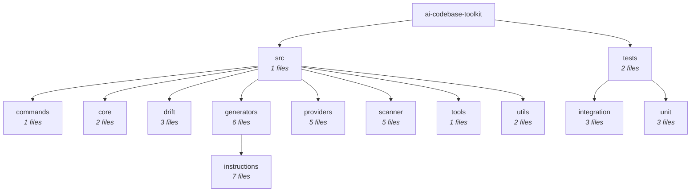

# Architecture — Source Tree

> Generated by AI Codebase Toolkit on 2026-04-26. Run **AI Toolkit: Generate Architecture Diagram** to refresh.

## Module tree

## Stats
- Source root: `ai-codebase-toolkit`
- Total source files: 41
- Frameworks: none detected

## How to read
- Each node is a folder.
- Leaves with file counts are the actual modules.
- Use this as the high-level map; for deep inspection of a single module, use **Generate Module Flowchart**.
