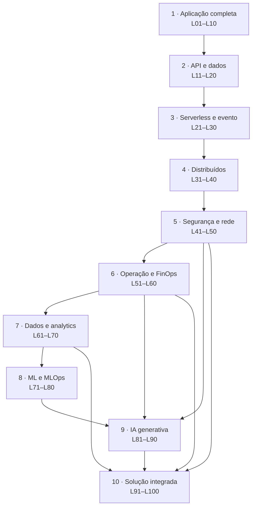

# Catálogo de 100 laboratórios de arquitetura AWS — do básico à solução com IA

> **O que é.** Cem laboratórios reproduzíveis que constroem, do zero, a competência
> de arquitetura de soluções na AWS: começa numa aplicação .NET 8 de três camadas
> que roda de verdade e termina numa plataforma de IA multi-time. Cada laboratório
> resolve um problema concreto, tem entregável verificável e reaproveita o que o
> anterior construiu.
>
> **Formato de implementação:** Terraform como IaC, YAML onde YAML é a linguagem
> nativa do artefato (workflow de CI, `buildspec`, manifesto de Kubernetes,
> template CloudFormation nos laboratórios em que CFN *é* o objeto de estudo).
> **Linguagem de aplicação:** C# / .NET 8.

---

## Este documento NÃO é o catálogo de 100 soluções de IA

Existem dois catálogos de cem nesta base, e confundi-los quebra código. A
distinção é o eixo, não o assunto:

| | [`CATALOGO_100_SOLUCOES_AWS_IA.md`](../seo/CATALOGO_100_SOLUCOES_AWS_IA.md) | **Este documento** |
|---|---|---|
| Numeração | `S1`–`S100` | `L01`–`L100` |
| Eixo | 100 **soluções de IA** — todas com IA no centro | 100 **laboratórios de arquitetura** — IA entra na banda 9 |
| Unidade | topologia + a decisão que ela ensina | laboratório reproduzível com entregável |
| Profundidade por item | 1 parágrafo + 1 diagrama percorrível de 5 passos | módulo completo: laboratório, IAM, código, falha, custo, limpeza |
| Onde vive | trilha [100 Arquiteturas de IA na AWS](/arquiteturas-ia-aws), 10 módulos × 10 soluções | um módulo por laboratório |
| Gerado? | **sim** — `scripts/seo/gerar_arquiteturas_100.py` lê a coluna Arquitetura | não; cada laboratório é escrito |

**Por que a numeração é separada.** Os 100 diagramas da trilha de IA são
**gerados** do documento `S`, e o gerador falha de propósito quando a cadeia muda
por baixo do desenho. Renumerar `S` para acomodar `L` quebraria os 100 diagramas.
Então `L` tem namespace próprio, e quando um laboratório da banda 9 ou 10
implementa uma solução do outro catálogo, a linha **cita** o `S` correspondente em
vez de reescrevê-lo. Um catálogo diz *qual é a topologia*; o outro leva alguém a
construí-la.

---

## Como ler as colunas

1. **Problema real** — em termos de negócio ou de operação, nunca "aprender o
   serviço X". Laboratório cujo problema é o nome de um serviço é tutorial.
2. **Nível** — `B` básico · `I` intermediário · `A` avançado · `E` especialista.
3. **Serviços principais** — 3 a 5. Um laboratório que lista dez serviços não tem
   foco; tem inventário.
4. **Conceito de certificação** — o conhecimento que a prova cobra, e em que
   nível. `CLF` Cloud Practitioner · `SAA` Solutions Architect Associate · `DVA`
   Developer Associate · `SOA` SysOps · `SAP` SA Professional · `DOP` DevOps
   Engineer Professional · `AIF` AI Practitioner · `MLA`/`MLS` Machine Learning.
5. **Entregável** — o que existe ao final, e que dá para mostrar. É a coluna que
   impede laboratório que termina em "agora você entende".
6. **Dependências** — laboratórios cujo entregável este reaproveita.
7. **Evolui para** — quem consome este entregável depois.

**A regra das três arquiteturas.** Todo laboratório apresenta a arquitetura
**mínima** (para aprender), a **recomendada para produção** e a **evolução**
avançada — porque o que separa quem monta de quem arquiteta é saber *quando a
solução precisa mudar*. Está normatizado na skill
[`.claude/skills/lab-arquitetura-aws.md`](../../.claude/skills/lab-arquitetura-aws.md).

---

## A progressão, em uma linha por banda

| Banda | Faixa | O que se conquista | Pré-requisito de entrada |
|---|---|---|---|
| 1 | L01–L10 | **Uma aplicação de três camadas em produção**, e cada concern isolado num laboratório | Conta AWS, Docker, C# básico |
| 2 | L11–L20 | API, autenticação, cache e o banco escolhido pela carga | Banda 1 |
| 3 | L21–L30 | Desacoplar: serverless, fila, evento, orquestração | Banda 2 |
| 4 | L31–L40 | Distribuir: microsserviço, saga, consistência eventual | Banda 3 |
| 5 | L41–L50 | Proteger e governar: IAM real, multi-conta, rede privada | Banda 4 |
| 6 | L51–L60 | Operar: observabilidade, pipeline, resiliência, FinOps | Banda 5 |
| 7 | L61–L70 | Transformar dado em ativo: lake, streaming, lakehouse | Banda 6 |
| 8 | L71–L80 | ML com disciplina de engenharia | Banda 7 |
| 9 | L81–L90 | IA generativa: RAG, agente, guardrail, avaliação | Banda 8 |
| 10 | L91–L100 | Solução completa de IA sobre tudo o que veio antes | Banda 9 |

**Por que IA só aparece na banda 9.** Não é conservadorismo pedagógico: um sistema
de IA em produção é um sistema distribuído com dados, permissão e observabilidade
— e quem não construiu essa base copia a topologia sem a decisão, monta o desenho
do RAG e responde errado. A banda 9 pressupõe as bandas 5, 6 e 7 justamente
porque é onde o RAG deixa de ser demonstração.

---

## Banda 1 — A primeira aplicação completa (L01–L10)

**Entra sabendo:** conta AWS ativa, Docker local, C# e SQL básicos.
**Sai sabendo:** desenhar, provisionar, publicar, observar, escalar, proteger e
restaurar uma aplicação de três camadas — e explicar cada decisão.

A banda toma **uma** aplicação e descasca um concern por laboratório. Isso é
deliberado: dez aplicações diferentes ensinam dez `terraform apply`; uma aplicação
com dez concerns ensina arquitetura.

| Nº | Título | Problema real | Nível | Serviços principais | Conceito de certificação | Entregável | Dependências | Evolui para |
|---|---|---|---|---|---|---|---|---|
| **L01** ★ | Aplicação .NET 8 em ECS Fargate com RDS e front na borda | A equipe roda a API na máquina de alguém; não há ambiente que o cliente alcance | B | ECS Fargate, RDS PostgreSQL, ALB, CloudFront | Três camadas, AZ como domínio de falha, sub-rede privada (CLF/SAA) | URL pública servindo a API e o front, banco em sub-rede privada, tudo em Terraform | — | L02, L03, L05 |
| **L02** ★ | A rede por baixo: por que o banco não tem rota para a internet | Banco publicamente acessível porque "assim funcionou" | B | VPC, sub-rede, NAT Gateway, tabela de rotas | Sub-rede pública vs privada, rota, NAT vs IGW (SAA) | VPC de duas AZs com plano de endereçamento documentado | L01 | L44, L45 |
| **L03** | Da imagem ao deploy sem indisponibilidade | Publicar exige aviso no canal e dez minutos fora do ar | B | ECR, ECS, Dockerfile multi-stage, ALB | Rolling update, health check, deregistration delay (DVA) | Imagem versionada no ECR e rollout observado sem erro 5xx | L01 | L39, L54 |
| **L04** ★ | Segredo fora do código, com rotação | Senha do banco em `appsettings.json`, no repositório | B | Secrets Manager, KMS, Parameter Store | Segredo vs parâmetro, rotação, envelope encryption (SAA/SOA) | Aplicação lendo credencial rotacionada; nenhum segredo no repo | L01 | L46 |
| **L05** | Domínio, TLS e o estático na borda | O front é servido pelo mesmo contêiner da API e a latência internacional dói | B | Route 53, ACM, CloudFront, S3 | Certificado gerenciado, comportamento de cache, origem (SAA) | Domínio próprio em HTTPS, estático em cache, API no mesmo domínio | L01 | L20, L47 |
| **L06** | Escalar quando chega gente de verdade | O serviço cai no pico da campanha e ninguém sabe qual número subir | I | ECS Service Auto Scaling, CloudWatch, ALB | Target tracking vs step scaling, métrica de escala (SAA/SOA) | Política de escala testada com carga, com o gráfico do evento | L01, L03 | L40, L06→L57 |
| **L07** | O banco sob carga: réplica, Multi-AZ e o pool | Latência sobe e a CPU do banco fica em 100% com poucas conexões | I | RDS Multi-AZ, réplica de leitura, Npgsql pooling | Multi-AZ ≠ escala de leitura; réplica; pool (SAA) | Leitura roteada para a réplica e failover ensaiado | L01 | L14, L15 |
| **L08** ★ | Enxergar o que quebrou | Erro 500 relatado pelo cliente; nos logs, nada correlacionável | I | CloudWatch Logs, métricas, X-Ray, OpenTelemetry | Log estruturado, correlação, trace distribuído (DVA/SOA) | Requisição rastreável ponta a ponta pelo `trace id` | L01 | L51, L52 |
| **L09** | A conta no fim do mês desta arquitetura | Fatura cresceu 3× e ninguém sabe qual componente | I | Cost Explorer, Budgets, tags de alocação | Dimensão de custo, tag, orçamento e alerta (CLF/SAA) | Rateio por tag e alerta antes de estourar | L01 | L59 |
| **L10** | Voltar de um desastre — com ensaio | Existe backup; nunca ninguém restaurou | I | RDS snapshot/PITR, AWS Backup | RPO e RTO, PITR, política de retenção (SAA/SOA) | Restauração cronometrada, com RTO e RPO medidos, não estimados | L01, L07 | L58 |

---

## Banda 2 — Aplicações web, APIs e dados (L11–L20)

**Entra sabendo:** banda 1. **Sai sabendo:** escolher o banco pela forma de
acesso, colocar cache sem criar bug de invalidação, e migrar schema sem parar.

| Nº | Título | Problema real | Nível | Serviços principais | Conceito de certificação | Entregável | Dependências | Evolui para |
|---|---|---|---|---|---|---|---|---|
| **L11** ★ | API Gateway na frente, ou ALB direto? | Precisa de chave de API, cota por cliente e versão — e o ALB não faz isso | I | API Gateway, ALB, ECS | REST vs HTTP API, uso de cota, quando ALB basta (DVA/SAA) | Endpoint com cota por cliente e a decisão registrada | L01 | L26 |
| **L12** | Autenticação e sessão que não guardam o que não devem | Sessão em memória do contêiner: escalar derruba o login | I | Cognito, ALB, ASP.NET Core | Pool de usuário, JWT, stateless (DVA) | Login federado com token validado no .NET, sem estado no contêiner | L01, L11 | L38, L93 |
| **L13** | Cache que salva o banco, e a invalidação que quebra tudo | 80% das consultas são idênticas e batem no RDS | I | ElastiCache Redis, RDS | Cache-aside, write-through, TTL, cold cache (SAA) | Latência p95 medida antes e depois, com regra de invalidação escrita | L07 | L17, L89 |
| **L14** ★ | Escolher o banco pela carga, no mesmo caso de uso | "Usa Postgres porque é o que a gente sabe" | I | RDS, Aurora, DynamoDB | Forma de acesso decide o banco (SAA) | Mesma feature nos três, com medição e a decisão justificada | L07 | L15, L16 |
| **L15** | Aurora de verdade: endpoint, Serverless v2 e failover | Carga varia 20× entre madrugada e pico | A | Aurora PostgreSQL, Serverless v2 | Cluster, endpoint de leitura, escala de capacidade (SAA/SAP) | Cluster com failover ensaiado e curva de capacidade | L14 | L58 |
| **L16** | DynamoDB para quem vem do SQL | Modelagem relacional em DynamoDB gerando `Scan` em tudo | A | DynamoDB, GSI | Chave de partição, GSI/LSI, single-table (DVA/SAA) | Tabela única servindo 4 padrões de acesso sem `Scan` | L14 | L29 |
| **L17** | Upload sem passar pela aplicação | Arquivo de 200 MB atravessa o contêiner e estoura memória | I | S3 presigned URL, CloudFront | URL pré-assinada, upload multipart (DVA) | Upload direto ao S3 com permissão temporária e limite de tamanho | L05 | L28, L92 |
| **L18** | Migrar schema em produção sem parar | Deploy exige janela porque a migration trava tabela | A | RDS, EF Core, ECS | Expand/contract, compatibilidade para frente (DOP) | Duas versões da aplicação convivendo durante a migração | L03, L07 | L39 |
| **L19** | Busca no catálogo: `LIKE` até onde? | Busca por texto ficou lenta e não tolera erro de digitação | I | OpenSearch Service, RDS | Índice invertido vs varredura, relevância (SAA) | Mesma busca nos dois, com limite de cada um medido | L14 | L85, L94 |
| **L20** | SPA na borda ou SSR no contêiner | SEO exige HTML pronto; o time quer SPA | I | S3, CloudFront, ECS | Renderização, cache na borda, TTFB (SAA) | As duas versões publicadas, com custo e TTFB comparados | L05 | L94 |

---

## Banda 3 — Serverless e arquitetura orientada a evento (L21–L30)

**Entra sabendo:** banda 2. **Sai sabendo:** absorver pico sem escalar
computação, e desacoplar sem perder rastreabilidade.

| Nº | Título | Problema real | Nível | Serviços principais | Conceito de certificação | Entregável | Dependências | Evolui para |
|---|---|---|---|---|---|---|---|---|
| **L21** | Primeira Lambda .NET 8 — e o cold start | Job de 2 s roda num Fargate ligado 24 h | I | Lambda (runtime `dotnet8`), CloudWatch | Modelo de execução, cold start, memória×CPU (DVA) | Função publicada, com cold start medido e Native AOT comparado | L01 | L22, L26 |
| **L22** ★ | Fila que absorve pico, com DLQ e idempotência | Pico de 10× derruba a API porque tudo é síncrono | I | SQS, Lambda, DynamoDB | Standard vs FIFO, visibility timeout, DLQ, idempotência (DVA/SAA) | Fila com DLQ, consumidor idempotente e reprocessamento provado | L21 | L23, L36 |
| **L23** | Fanout: um evento, vários interessados | Cada novo consumidor exige alterar o produtor | I | SNS, SQS, Lambda | Fanout, filtro de assinatura, entrega (SAA) | Terceiro consumidor adicionado sem tocar no produtor | L22 | L24 |
| **L24** | EventBridge como espinha dorsal | Integrações ponto a ponto formaram uma teia | A | EventBridge, schema registry, Lambda | Barramento, regra, padrão de evento, replay (SAA/DOP) | Barramento com contrato de evento versionado e replay demonstrado | L23 | L96 |
| **L25** ★ | Orquestrar com Step Functions, ou no código? | Fluxo de 6 passos com retry vive num `try/catch` de 400 linhas | A | Step Functions, Lambda | Máquina de estado, retry, catch, saga (DVA/SAP) | Mesmo fluxo nas duas formas, com a falha injetada nos dois | L22 | L35, L76 |
| **L26** | API 100% serverless — e onde ela não serve | Custo do Fargate ocioso em ambiente de homologação | I | API Gateway, Lambda, DynamoDB | Serverless de ponta a ponta, limite de payload (DVA) | Mesma API das bandas 1–2 em serverless, com custo comparado | L11, L16, L21 | L30 |
| **L27** | Agendamento sem a EC2 do `cron` | Uma EC2 ligada só para rodar `cron` | B | EventBridge Scheduler, Lambda | Agendamento gerenciado, janela e fuso (SOA) | Todos os agendamentos migrados, com a EC2 desligada | L21 | L95 |
| **L28** | Processar o arquivo que acabou de chegar | Alguém roda o script à mão quando o cliente envia a planilha | I | S3 Notification, EventBridge, Lambda | Evento de objeto, entrega ao menos uma vez (DVA) | Pipeline disparado pelo upload, com trilha de cada arquivo | L17, L22 | L92 |
| **L29** | Streaming de mudança do banco | Sistema secundário fica desatualizado por consulta periódica | A | DynamoDB Streams, Aurora CDC, Kinesis | CDC, ordem por partição, exactly-once aparente (SAP) | Consumidor reagindo à mudança, com a ordem preservada | L16 | L63 |
| **L30** | Os limites do serverless, medidos | Migrou tudo para Lambda e o processamento de 20 min não caberia | A | Lambda, Fargate, Step Functions | Timeout, concorrência, payload, tamanho (SAA/SAP) | Tabela de limites medidos e a regra de quando voltar ao contêiner | L26 | L34 |

---

## Banda 4 — Containers, microsserviços e sistemas distribuídos (L31–L40)

**Entra sabendo:** banda 3. **Sai sabendo:** o custo real de distribuir — e por
que a maioria dos sistemas não deveria.

| Nº | Título | Problema real | Nível | Serviços principais | Conceito de certificação | Entregável | Dependências | Evolui para |
|---|---|---|---|---|---|---|---|---|
| **L31** ★ | Quebrar o monolito pelo corte certo | Deploy de qualquer coisa exige testar tudo | A | ECS, ALB, RDS | Fronteira de transação, acoplamento (SAP) | Um serviço extraído, com a fronteira justificada por transação | L03 | L32, L38 |
| **L32** | Síncrono ou assíncrono entre serviços | Cadeia de 4 chamadas HTTP: se uma cai, todas caem | A | ECS, SQS, EventBridge | Acoplamento temporal, disponibilidade composta (SAP) | Mesma integração nas duas formas, com disponibilidade calculada | L31 | L33, L37 |
| **L33** | Descoberta e malha: Service Connect, VPC Lattice ou nada | IP fixo em variável de ambiente | A | ECS Service Connect, VPC Lattice, Cloud Map | Service discovery, mTLS, malha (SAP) | Comunicação por nome, com mTLS e a decisão entre as três | L32 | L34 |
| **L34** | EKS quando ECS não basta — o que muda de verdade | "Vamos de Kubernetes" sem critério | E | EKS, Fargate, manifestos YAML | Plano de controle, IRSA, custo operacional (SAP/DOP) | Mesmo serviço nos dois, com o custo operacional medido | L30, L33 | L42 |
| **L35** | Saga: transação distribuída sem 2PC | Pedido pago sem estoque reservado | E | Step Functions, SQS, DynamoDB | Saga, compensação, idempotência (SAP) | Fluxo com compensação exercitada por falha injetada | L25, L32 | L37 |
| **L36** ★ | Retry, backoff, jitter e circuit breaker no .NET | Retry sem backoff transformou instabilidade em apagão | A | Polly, SQS, ALB | Retry storm, backoff exponencial, disjuntor (DVA/SAP) | Políticas configuradas e o retry storm reproduzido antes/depois | L22 | L40, L57 |
| **L37** | Consistência eventual do ponto de vista do usuário | Usuário salva e não vê a alteração; suporte chama de bug | A | DynamoDB, SQS, ElastiCache | Leitura consistente vs eventual, read-your-writes (SAP) | Estratégia de leitura que resolve o sintoma, com o trade-off escrito | L32, L35 | L67 |
| **L38** | Multi-tenant: linha, schema ou conta | Vazamento de dado entre clientes numa consulta sem filtro | E | RDS, DynamoDB, IAM, Organizations | Isolamento, blast radius, ruído entre inquilinos (SAP) | Os três modelos implementados, com o teste de vazamento | L12, L31 | L43, L98 |
| **L39** | Blue/green e canário no ECS | Deploy ruim só aparece com 100% do tráfego dentro | A | CodeDeploy, ECS, ALB | Blue/green, canário, rollback automático (DOP) | Deploy canário com rollback disparado por alarme | L03, L18 | L54 |
| **L40** | Teste de carga e o gargalo real | Ninguém sabe quantos usuários a arquitetura suporta | A | ALB, CloudWatch, ECS | Gargalo, saturação, capacidade (SOA/SAP) | Curva de carga até a quebra, com o gargalo nomeado | L06, L36 | L52, L57 |

---

## Banda 5 — Segurança, identidade, rede e governança (L41–L50)

**Entra sabendo:** banda 4. **Sai sabendo:** escrever permissão que passa
auditoria e desenhar rede que não depende de confiança implícita.

| Nº | Título | Problema real | Nível | Serviços principais | Conceito de certificação | Entregável | Dependências | Evolui para |
|---|---|---|---|---|---|---|---|---|
| **L41** ★ | Da policy `*` à policy que passa auditoria | Todo mundo com `AdministratorAccess` "para não travar" | A | IAM, Access Analyzer, CloudTrail | Menor privilégio, condição, limite de permissão (SAA/SOA) | Policy derivada do uso real, com o `*` removido e nada quebrado | L01 | L42, L48 |
| **L42** | Identidade de workload: task role, execution role, IRSA | Chave de acesso de longa duração numa variável de ambiente | A | IAM, ECS task role, EKS IRSA, STS | Role vs usuário, credencial temporária (SAA/DVA) | Nenhuma chave estática; tudo por role assumida | L34, L41 | L46 |
| **L43** ★ | Multi-conta: OU, SCP e Control Tower | Dev e produção na mesma conta, com o mesmo IAM | E | Organizations, SCP, Control Tower, Identity Center | Fronteira de conta, SCP como teto, landing zone (SAP) | Duas OUs com SCP que impede o que a policy permitiria | L38, L41 | L56, L98 |
| **L44** | Rede privada de verdade — e o NAT que você não precisa | Tráfego para o S3 saindo pela internet e pagando NAT | A | VPC endpoint, PrivateLink, S3 gateway endpoint | Gateway vs interface endpoint, custo de NAT (SAA/SAP) | Tráfego de serviço sem sair da AWS, com a economia medida | L02 | L45, L99 |
| **L45** | Rede híbrida: VPN, Direct Connect, Transit Gateway | Sistema legado no datacenter precisa falar com a VPC | E | Site-to-Site VPN, Direct Connect, Transit Gateway | Topologia hub-and-spoke, roteamento, resiliência de link (SAP) | Conectividade híbrida com rota documentada e plano de falha | L44 | L99 |
| **L46** | Criptografia: KMS, envelope, CMK e rotação | "Está criptografado" sem ninguém saber com qual chave | A | KMS, S3, RDS, Secrets Manager | Envelope encryption, CMK vs chave gerenciada, policy de chave (SAA) | Dado em repouso com CMK própria, rotação e trilha de uso | L04, L42 | L49 |
| **L47** | WAF e Shield: barrar antes de custar computação | Bot consumindo capacidade e inflando a fatura | A | AWS WAF, Shield, CloudFront | Regra gerenciada, rate limit, camada de bloqueio (SAA/SOA) | Ataque simulado bloqueado na borda, com custo evitado | L05 | L90 |
| **L48** | Detecção: GuardDuty, Security Hub, Config | Achado de segurança chega por e-mail e ninguém trata | A | GuardDuty, Security Hub, Config, EventBridge | Detecção vs prevenção, conformidade contínua (SOA/SAP) | Achado gerando ticket automático, com prazo de resposta | L41 | L50 |
| **L49** | Dado pessoal: minimizar, mascarar, não logar | CPF em log de aplicação, retido por 90 dias | A | Macie, CloudWatch Logs, KMS | Classificação, minimização, retenção (SAP) | Varredura sem achado e log sem dado pessoal | L46 | L97 |
| **L50** | Resposta a incidente e blast radius | Credencial vazada; ninguém sabe o que ela alcançou | E | CloudTrail, Athena, IAM, Organizations | Trilha imutável, contenção, raio de alcance (SAP) | Runbook executado sobre trilha real, com contenção cronometrada | L43, L48 | L97 |

---

## Banda 6 — Observabilidade, DevOps, resiliência e FinOps (L51–L60)

**Entra sabendo:** banda 5. **Sai sabendo:** operar o que construiu — e provar
que ele volta quando cai.

| Nº | Título | Problema real | Nível | Serviços principais | Conceito de certificação | Entregável | Dependências | Evolui para |
|---|---|---|---|---|---|---|---|---|
| **L51** ★ | Os três pilares no .NET com OpenTelemetry | Log, métrica e trace em três lugares que não se cruzam | A | OpenTelemetry, CloudWatch, X-Ray, ADOT | Log/métrica/trace, cardinalidade, amostragem (SOA/DOP) | Telemetria correlacionada por `trace id` em toda a stack | L08 | L52, L53 |
| **L52** | SLO, error budget e alarme que acorda alguém | 40 alarmes; ninguém olha nenhum | A | CloudWatch, SNS, Incident Manager | SLI/SLO, error budget, alerta acionável (DOP) | 3 SLOs com orçamento de erro e alarme ligado a plantão | L51 | L57 |
| **L53** | Dashboard que responde pergunta de operação | Painel bonito que não diz se o sistema está bem | I | CloudWatch Dashboards, Logs Insights | Métrica técnica vs de negócio (SOA) | Painel que responde 6 perguntas nomeadas | L51 | L59 |
| **L54** ★ | Pipeline: CodePipeline ou GitHub Actions com OIDC | Deploy feito da máquina de um dev com chave pessoal | A | CodePipeline, CodeBuild, GitHub OIDC, ECR | CI/CD, artefato, credencial federada (DOP) | Pipeline que constrói, testa e publica sem chave estática | L03, L39, L42 | L55, L56 |
| **L55** | Terraform em módulo, com estado remoto e drift | `terraform.tfstate` no laptop e drift silencioso | A | S3 + DynamoDB lock, Terraform | IaC, estado, idempotência, drift (DOP) | Módulos reutilizáveis, estado remoto e drift detectado no CI | L54 | L56 |
| **L56** | Um ambiente por conta, sem copiar e colar | `dev` e `prod` divergiram e ninguém sabe onde | A | Organizations, Terraform workspace, Identity Center | Promoção de ambiente, paridade (DOP/SAP) | Três ambientes do mesmo código, com diferença só em variável | L43, L55 | L98 |
| **L57** | Chaos: derrubar uma AZ de propósito | Alta disponibilidade no desenho, nunca testada | E | Fault Injection Service, ECS, RDS | Injeção de falha, hipótese, raio controlado (SAP/DOP) | Experimento com hipótese escrita e resultado medido | L40, L52 | L58 |
| **L58** ★ | DR multi-região: as quatro estratégias | Plano de DR em documento, sem RTO medido | E | Route 53, Aurora Global, AWS Backup, DRS | Backup/restore, pilot light, warm standby, ativo-ativo (SAP) | Failover regional ensaiado, com RTO e RPO medidos | L10, L15, L57 | L99 |
| **L59** | FinOps: medir antes de comprar compromisso | Savings Plans comprado antes do rightsizing | A | Cost Explorer, Compute Optimizer, Savings Plans, Spot | Compromisso vs elasticidade, rightsizing (SAA/SAP) | Redução comprovada sem degradar SLO | L09, L53 | L89, L98 |
| **L60** | Well-Architected review da sua própria arquitetura | Nunca ninguém revisou o que está no ar | A | Well-Architected Tool | Os seis pilares, risco alto vs médio (SAP) | Revisão dos seis pilares com plano priorizado | L52, L58, L59 | L100 |

---

## Banda 7 — Dados, streaming, analytics e plataforma de dados (L61–L70)

**Entra sabendo:** banda 6. **Sai sabendo:** separar operacional de analítico e
construir o lake que a banda 9 vai consumir.

| Nº | Título | Problema real | Nível | Serviços principais | Conceito de certificação | Entregável | Dependências | Evolui para |
|---|---|---|---|---|---|---|---|---|
| **L61** | Do operacional ao analítico: por que não consultar a produção | Relatório do BI travando o banco do cliente | I | RDS, S3, DMS | Carga OLTP vs OLAP, isolamento (SAA) | Extração incremental sem impacto medido na produção | L07 | L62 |
| **L62** ★ | Data lake em camadas: bronze, prata, ouro | S3 com 40 mil arquivos e ninguém sabe qual serve | A | S3, Glue, Lake Formation | Zonas do lake, formato, particionamento (MLA) | Lake em três camadas com contrato de cada uma | L61 | L65, L67 |
| **L63** | Ingestão em streaming: shard, ordem e reprocesso | Evento perdido no pico e ordem trocada | A | Kinesis Data Streams, Lambda | Shard, chave de partição, checkpoint (MLA/SAP) | Ingestão com ordem por chave e reprocessamento a partir do início | L29 | L64 |
| **L64** | Entrega e formato: Parquet, partição, arquivo pequeno | Consulta varrendo 400 GB para responder um dia | I | Amazon Data Firehose, S3, Parquet | Formato colunar, compactação, partição (MLA) | Mesma consulta com bytes varridos reduzidos, medidos | L63 | L66 |
| **L65** | Catálogo e ETL: Glue Catalog, crawler, job | Schema conhecido só por quem escreveu o script | I | Glue Data Catalog, Glue ETL | Catálogo, evolução de schema (MLA) | Catálogo alimentado e job idempotente | L62 | L66, L69 |
| **L66** | Consultar o lake e pagar pouco: Athena | Custo de consulta imprevisível e alto | I | Athena, S3, Glue | Custo por byte varrido, CTAS, projeção de partição (MLA) | Consulta 10× mais barata, com o antes/depois | L64, L65 | L68 |
| **L67** | Lakehouse: Iceberg, upsert e time travel | Correção de dado histórico exige reescrever a partição | E | S3 Tables / Iceberg, Athena, Glue | Tabela transacional, snapshot, compaction (MLA) | `UPDATE`/`DELETE` no lake e consulta a estado passado | L37, L62 | L68 |
| **L68** | Redshift quando o BI dói | Painel de 40 s que o Athena não resolve | A | Redshift, Spectrum, S3 | Distribuição, sort key, MPP (MLA/MLS) | Painel abaixo de 3 s, com a chave de distribuição justificada | L66, L67 | L70 |
| **L69** | Governança do lake: permissão por coluna | Analista com acesso a coluna de dado pessoal | A | Lake Formation, IAM, Macie | Permissão fina, tag-based access (SAP) | Acesso por coluna e por linha, com o teste de negativa | L49, L65 | L97 |
| **L70** | Qualidade de dado: contrato e quarentena | Modelo treinado com dado que mudou de unidade | A | Glue Data Quality, EventBridge, S3 | Contrato de dado, validação, quarentena (MLA) | Registro ruim em quarentena, com alerta ao produtor | L65, L68 | L72, L77 |

---

## Banda 8 — Machine learning e MLOps (L71–L80)

**Entra sabendo:** banda 7. **Sai sabendo:** tratar modelo como artefato de
software — versionado, avaliado, promovido e revertido.

| Nº | Título | Problema real | Nível | Serviços principais | Conceito de certificação | Entregável | Dependências | Evolui para |
|---|---|---|---|---|---|---|---|---|
| **L71** | Quando ML resolve, e quando uma regra resolve melhor | Modelo entregue para um problema que três `if` resolviam | I | SageMaker AI, Lambda | Baseline, viabilidade, custo do erro (AIF/MLA) | Baseline de regra batendo ou não o modelo, com o número | L70 | L72 |
| **L72** | Feature store: o mesmo cálculo no treino e na inferência | Acurácia boa no treino, ruim em produção | A | SageMaker Feature Store, Glue | Training/serving skew, ponto no tempo (MLA/MLS) | Mesma feature nos dois caminhos, com skew medido em zero | L70, L71 | L73 |
| **L73** | Treinar no SageMaker AI com experimento rastreável | Ninguém reproduz o modelo que está em produção | A | SageMaker AI, S3, Experiments | Job de treino, hiperparâmetro, reprodutibilidade (MLA) | Modelo reproduzível a partir do commit e do dado | L72 | L74, L75 |
| **L74** ★ | Servir: tempo real, serverless, assíncrono ou lote | Endpoint de GPU ligado para 200 inferências por dia | A | SageMaker AI endpoints, Batch Transform | Quatro modos de inferência, custo e latência (MLA/MLS) | Os quatro modos medidos e a escolha justificada | L73 | L79, L80 |
| **L75** | Registry e promoção com rollback | Modelo pior promovido e sem caminho de volta | A | SageMaker Model Registry, CodePipeline | Versão, aprovação, rollback (MLA/DOP) | Promoção com aprovação e rollback exercitado | L54, L73 | L76 |
| **L76** | Pipeline de ML de ponta a ponta | Treino disparado à mão por um notebook | A | SageMaker Pipelines, Step Functions, EventBridge | Orquestração, cache de passo, linhagem (MLA) | Pipeline disparado por dado novo, com linhagem | L25, L75 | L77 |
| **L77** | Drift: descobrir antes do negócio reclamar | Qualidade caiu há dois meses; ninguém notou | A | SageMaker Model Monitor, CloudWatch | Drift de dado e de conceito, baseline (MLA/MLS) | Alarme de drift disparado com dado deslocado de propósito | L70, L76 | L88 |
| **L78** | Avaliação honesta: métrica de modelo ≠ de negócio | AUC ótima, receita igual | A | SageMaker Clarify, Athena | Métrica de negócio, viés, teste A/B (MLS/AIF) | Avaliação ligada a um número de negócio | L74, L77 | L88 |
| **L79** | Consumir o modelo do .NET com fallback | Timeout do endpoint derruba a requisição do usuário | A | SageMaker endpoint, Polly (retry), ALB | Latência, timeout, degradação graciosa (DVA) | Cliente .NET com timeout, retry e caminho degradado | L36, L74 | L81 |
| **L80** | Custo de ML: onde o dinheiro vaza | Fatura de ML dominada por recurso ocioso | A | Cost Explorer, SageMaker, Compute Optimizer | Custo de endpoint parado, GPU ociosa (MLS) | Redução medida sem perda de qualidade | L59, L74 | L89 |

---

## Banda 9 — IA generativa, RAG e agentes (L81–L90)

**Entra sabendo:** bandas 5, 6 e 7 — permissão, observabilidade e dado.
**Sai sabendo:** construir sistema com LLM que se sustenta em produção, e provar
que ele funciona.

> Aqui os laboratórios passam a citar o outro catálogo. `S##` remete a
> [`CATALOGO_100_SOLUCOES_AWS_IA.md`](../seo/CATALOGO_100_SOLUCOES_AWS_IA.md), onde
> a topologia e a origem já estão documentadas.

| Nº | Título | Problema real | Nível | Serviços principais | Conceito de certificação | Entregável | Dependências | Evolui para |
|---|---|---|---|---|---|---|---|---|
| **L81** | Primeira chamada ao Bedrock do .NET 8 | Time quer usar LLM e não sabe onde a chamada mora | I | Bedrock, IAM, CloudWatch | Modelo gerenciado, ID com prefixo de provedor, streaming (AIF) | Cliente .NET com streaming, retry e custo por chamada logado | L42, L79 | L82, L83 |
| **L82** | Prompt em produção não é configuração | Prompt alterado direto no console; qualidade caiu sem rastro | I | Bedrock (gerenciamento de prompt), Git, CodePipeline | Versionamento de prompt, teste de regressão (AIF) | Prompt versionado com teste que reprova alteração ruim | L54, L81 | L88 |
| **L83** ★ | RAG mínimo que funciona, com citação | Resposta plausível e errada, sem fonte | A | Bedrock, Knowledge Bases, S3, OpenSearch | Chunking, embedding, recuperação, atribuição (AIF/MLS) | RAG respondendo com trecho citável e taxa de acerto medida | L62, L81 | L84, L85 · S4 |
| **L84** | Onde guardar vetor: quatro opções, uma decisão | Escolha do banco vetorial feita por moda | A | Knowledge Bases, OpenSearch, S3 Vectors, pgvector (Aurora) | Índice ANN, recall vs latência vs custo (MLS) | As quatro medidas no mesmo acervo, com a decisão escrita | L14, L83 | L85 |
| **L85** | Recuperação híbrida e reranking | RAG erra porque recupera o trecho errado, não porque gera mal | E | OpenSearch (BM25 + vetor), Bedrock rerank | Fusão de recall, cross-encoder, RRF (MLS) | Ganho de acerto medido só mexendo na recuperação | L19, L84 | L94 |
| **L86** | Guardrails: o que protege e o que não protege | Filtro na saída tratado como controle de segurança | A | Bedrock Guardrails, WAF, IAM | Filtro de conteúdo, tópico negado, limite do controle (AIF) | Guardrail com caso de contorno documentado | L47, L83 | L90 |
| **L87** ★ | Agente com ferramenta: quem executa é o seu código | Agente com permissão ampla "para conseguir agir" | E | Bedrock AgentCore, Lambda, IAM, DynamoDB | Laço de agente, teto de voltas, permissão por ferramenta (AIF) | Agente com IAM por ferramenta e limite de iteração aplicado | L41, L83 | L96 · S3 |
| **L88** | Avaliar sistema com LLM: golden set e juiz | "Melhorou" declarado por impressão | E | Bedrock (avaliação), S3, Athena | Golden set, LLM como juiz, viés do juiz (MLS/AIF) | Suíte que reprova regressão de qualidade no CI | L78, L82 | L100 |
| **L89** | Custo e latência de GenAI | Fatura de token cresceu 6× em um mês | A | Bedrock, ElastiCache, Bedrock batch, Budgets | Cache explícito de prompt, modelo por tarefa, lote (AIF) | Redução de custo por resposta, com qualidade mantida | L13, L59, L80 | L95 |
| **L90** | Prompt injection e vazamento entre inquilinos | Documento do cliente A citado na resposta ao cliente B | E | IAM, Knowledge Bases, Guardrails, Cognito | Injeção indireta, isolamento por fonte, confiança de conteúdo (AIF) | Ataque reproduzido e bloqueado, com teste no CI | L38, L86 | L97 |

---

## Banda 10 — Arquiteturas integradas de solução com IA (L91–L100)

**Entra sabendo:** banda 9. Cada laboratório aqui **combina** domínios: aplicação,
dado, segurança, operação e IA no mesmo desenho — que é o que a prática cobra e o
que a certificação Professional testa.

| Nº | Título | Problema real | Nível | Serviços principais | Conceito de certificação | Entregável | Dependências | Evolui para |
|---|---|---|---|---|---|---|---|---|
| **L91** | Atendimento com voz, prazo de resposta e saída para humano | Fila alta e resposta inconsistente, com prazo de 2,5 s | E | Connect, Transcribe, Bedrock, Knowledge Bases | Latência como requisito que elimina modelo (AIF/SAP) | Atendimento com prazo medido e escalonamento instrumentado | L83, L89 · S1, S2 | L100 |
| **L92** | IDP: documento → extração → interpretação → revisão humana | Dado estruturado preso em PDF, com erro caro | E | Textract, Bedrock, A2I, DynamoDB | Extração determinística antes do modelo (AIF) | Pipeline com confiança por campo e revisão humana no desenho | L28, L83 | L97 |
| **L93** | Copiloto interno com permissão por fonte | Resposta vazando material entre times | E | Bedrock, Knowledge Bases, Identity Center | Permissão da fonte propagada à resposta (SAP/AIF) | Copiloto que responde diferente conforme quem pergunta | L12, L90 | L98 |
| **L94** | Busca de produto com IA: híbrida, rerank e geração | Busca ruim derrubando conversão | E | OpenSearch, Bedrock, CloudFront | Recuperação decide qualidade; geração só apresenta (MLS) | Busca com ganho de conversão medido em teste A/B | L20, L85 | L100 |
| **L95** | Enriquecimento em lote do acervo | Classificar 2 milhões de itens sem ninguém esperando | A | Bedrock batch, S3, Step Functions, Athena | Lote vs tempo real: metade do custo, janela de horas (AIF) | Acervo classificado, com custo por item medido | L27, L89 | L98 |
| **L96** | Agente de operação que diagnostica incidente | Plantão levanta às 3 h para ler o mesmo painel | E | Bedrock AgentCore, CloudWatch, Lambda, EventBridge | Ferramenta somente-leitura, blast radius do agente (DOP/AIF) | Agente que produz hipótese com evidência, sem poder agir | L24, L51, L87 | L100 |
| **L97** | Risco e conformidade de decisão automatizada | Auditoria pergunta por que o sistema recusou um cliente | E | CloudTrail, Audit Manager, S3 Object Lock, Bedrock | Trilha imutável de decisão, explicabilidade (SAP) | Trilha que reconstrói uma decisão de ponta a ponta | L50, L69, L92 | L100 |
| **L98** | Plataforma de IA multi-time com cota e chargeback | Um time consumiu a cota de todos | E | Organizations, Bedrock, Budgets, Identity Center | Cota, isolamento por conta, rateio (SAP) | Plataforma com cota por time e fatura por centro de custo | L43, L56, L95 | L100 |
| **L99** | Multi-região para IA: onde o modelo existe, onde o dado pode estar | Requisito de residência de dado versus disponibilidade regional do modelo | E | Bedrock, Route 53, Aurora Global, PrivateLink | Residência de dado, disponibilidade regional, failover (SAP) | Roteamento por região com residência respeitada | L44, L58, L83 | L100 |
| **L100** ★ | Projeto final: plataforma .NET 8 + AWS + IA | Reunir tudo num sistema que alguém pagaria para operar | E | (integra os 99 anteriores) | Os seis pilares aplicados a um sistema real (SAP) | Sistema completo com revisão Well-Architected e DR ensaiado | L60, L88, L96, L97, L98 | — |

---

## Os 20 essenciais para portfólio

Marcados com ★ nas tabelas. Se alguém tem tempo para vinte e não para cem, são
estes — escolhidos por serem os que aparecem em entrevista de arquitetura e os que
outros laboratórios mais reaproveitam:

**L01** três camadas em produção · **L02** rede privada · **L04** segredo com
rotação · **L08** rastro ponta a ponta · **L11** API com cota · **L14** banco pela
carga · **L22** fila idempotente com DLQ · **L25** orquestração vs código ·
**L31** primeiro corte do monolito · **L36** retry, backoff e disjuntor · **L41**
menor privilégio derivado do uso · **L43** multi-conta com SCP · **L51**
OpenTelemetry no .NET · **L54** pipeline sem chave estática · **L58** DR com RTO
medido · **L62** lake em camadas · **L74** quatro modos de inferência · **L83**
RAG com citação · **L87** agente com permissão por ferramenta · **L100** projeto
final.

**Desafio — sem roteiro (10/ago/2026):** estes 20 são também os únicos com a
décima seção — um requisito novo, derivado da arquitetura do próprio
laboratório, com critério de aceite executável e sem passo a passo. Cobrado
só desta lista em `validate_cobertura_secoes.py` (ver `LABS_ANCORA` no
script) — os outros 80 laboratórios nunca prometeram essa seção.

---

## Dependência entre as bandas

As três arestas que saltam bandas são o ponto do desenho: a banda 9 **não** herda
só da 8. Um RAG em produção depende de permissão (banda 5), de telemetria (banda
6) e de dado governado (banda 7) mais do que depende de treinar modelo (banda 8).
Quem chega à IA pela banda 8 sozinha constrói demonstração.

---

## Regras de progressão que este catálogo obedece

1. **Cada laboratório resolve um problema concreto.** Nenhum título é o nome de um
   serviço.
2. **Nenhum laboratório repete outro trocando o serviço.** Quando dois serviços
   competem, eles aparecem *no mesmo* laboratório, medidos — L14 (RDS vs Aurora vs
   DynamoDB), L84 (quatro bancos vetoriais), L74 (quatro modos de inferência).
3. **A dificuldade cresce pela quantidade de restrições simultâneas**, não pelo
   número de serviços.
4. **IA entra depois de dado, segurança e operação** — as arestas que saltam
   bandas no grafo acima existem por isso.
5. **L91–L100 combinam domínios.** Nenhum deles é monotemático.
6. **O entregável é verificável.** "Entendeu" não é entregável; "RTO medido em 14
   min" é.
7. **Todo recurso criado aparece na limpeza.** É seção obrigatória de cada módulo,
   e existe porque laboratório de arquitetura deixa NAT Gateway, Elastic IP e
   snapshot cobrando depois que a aula termina.

### O que ficou deliberadamente fora

- **Preço em número.** Preço muda; o que a prova cobra e o que a decisão exige é o
  *modelo* de cobrança (por requisição, por hora ligada, por byte varrido, por
  token, com desconto em lote). Cada módulo aponta para o AWS Pricing Calculator.
- **Serviço em prévia.** Laboratório sobre recurso que pode mudar de forma gera
  conteúdo que envelhece antes de ser lido.
- **Mermaid nos módulos.** O renderizador da plataforma não desenha Mermaid; ele
  desenha `arch_diagram`, que é percorrível passo a passo. Mermaid aparece só neste
  documento de planejamento, que é lido no GitHub. A skill explica a conversão.

---

## Estado de execução

| Banda | Escritos | Total |
|---|---|---|
| 1 — Aplicação completa | **10 — completa** (L01 a L10) | 10 |
| 2 — API e dados | **10 — completa** (L11 a L20) | 10 |
| 3 — Serverless e eventos | **10 — completa** (L21 a L30) | 10 |
| 4 — Containers e distribuídos | **10 — completa** (L31 a L40) | 10 |
| 5 — Segurança, identidade, redes | **10 — completa** (L41 a L50) | 10 |
| 6 — Observabilidade, DevOps, FinOps | **10 — completa** (L51 a L60) | 10 |
| 7 — Dados, streaming, analytics | **10 — completa** (L61 a L70) | 10 |
| 8 — Machine learning e MLOps | **10 — completa** (L71 a L80) | 10 |
| 9 — IA generativa, RAG e agentes | **10 — completa** (L81 a L90) | 10 |
| 10 — Arquiteturas profissionais integradas | **10 — completa** (L91 a L100) | 10 |

**A série está completa: 100 de 100 laboratórios, 10 de 10 bandas.** Fechada em
08/ago/2026. O L100 é o capstone — não segue o formato mínima→produção→evolução
dos outros 99 (é síntese, não um problema novo): dois `arch_diagram` genuinamente
distintos (visão de sistema integrado + topologia de DR/failover), um
`layer_stack` de MATURIDADE da plataforma em vez de evolução de uma técnica, e
uma revisão Well-Architected honesta que mantém sustentabilidade em risco alto
— herdado do L60, não resolvido artificialmente para o módulo ficar bonito. O
DR ensaiado mede RTO/RPO do sistema INTEIRO (4h51min), dominado pelo mesmo
gargalo de banco que o L58 já havia medido isoladamente (4h47min) — o capstone
não inventou um número novo, reusou e validou o que a série já tinha
estabelecido.

### Auditoria de progressão e nivelamento das bandas 9 e 10 (09/ago/2026)

Uma medição dos 100 seeds — não amostra — respondeu se a série realmente evolui
em complexidade e se cada etapa é profissional. O que se sustentou e o que não:

**Sustentou-se.** A continuidade narrativa é real: 99 dos 100 laboratórios citam
laboratórios anteriores (só o L30 é ilha), e as 56 referências a laboratórios
FUTUROS foram classificadas uma a uma — nenhuma trata um lab futuro como
conhecido; todas são ponteiros honestos. O salto mínima→produção é real: +3,9 nós
e +4,9 arestas em média nos 95 laboratórios com os dois diagramas (5 não crescem
em nós: L15, L16, L26, L46, L73). A progressão de nível é dente-de-serra
correta — reseta para intermediate quando abre domínio novo (L61 dados, L71 ML,
L81 IA) e sobe até advanced.

**Não se sustentou: as bandas 9 e 10 regrediam.** O template normativo
(`.claude/skills/lab-arquitetura-aws.md`) exige nove seções que separam um
laboratório de arquitetura de um tutorial. As bandas 1–8 as tinham em ~100% dos
80 laboratórios; as bandas 9 e 10, escritas por último, tinham perdido **88
seções em 21 laboratórios** — onze deles com três ou mais ausências, nove com
sete ou oito. Custos/FinOps sobrevivia em 35% da banda 10; injeção de falha, em
15%. A média de seções por laboratório caía de 27,7 para 22,2. Nenhum gate via:
`validate_labs_aws.py` confere as três arquiteturas, `validate_barra_ensino.py`
confere a qualidade dentro dos blocos, e nenhum dos dois pergunta se a seção
existe.

O sinal quantitativo que denunciava sozinho: **XP por 1000 caracteres subia 4,1x
ao longo da série** — a banda 10 pagava 242 XP por menos conteúdo do que a banda
1 pagava 130. E o `readTime` DECLARADO subia (36,7 → 46,9 min) enquanto o texto
real caía: era campo digitado à mão, não derivado do conteúdo.

**Correções aplicadas.** As 88 seções foram escritas, seguindo o padrão das
bandas 1–8 e adaptando a pergunta onde IA muda a dimensão — custo por token e
por revisão humana em vez de por hora de instância, escala esbarrando em cota de
modelo antes de CPU, injeção de falha derrubando o modelo e envenenando o acervo
em vez de derrubar uma AZ. Volume real (contando tabela) ficou uniforme:
74,8k–83k caracteres por laboratório nas bandas 2 a 10. O `readTime` de L81–L100
foi derivado do volume pela razão que as bandas 2–8 já praticavam (0,469 min por
1000 caracteres), trazendo a série inteira para a faixa 26–44 min — o capstone
ficou no topo da faixa, não fora dela como os 72 min anteriores.

**Gate novo: `scripts/validate_cobertura_secoes.py`.** Cobre as nove seções pelo
título, aceitando as variantes que o corpus real usa ("Custos e FinOps",
"Anti-patterns", "Extensão com IA", "Onde MAIS IA entra"), e **não** cobra o
bloco de dentro — tabela e lista ensinam observabilidade igualmente bem. Provado
com nove mutações num seed real, uma por seção removida, mais a prova negativa
de que não reprova os laboratórios corretos.

Dois defeitos de gate apareceram durante o trabalho e foram corrigidos na raiz,
não contornados: em `validate_barra_ensino.py`, `provar` sem fronteira de palavra
casava dentro de "a**provar**" e reprovava uma seção que não é de prova; e o
padrão `^onde (a )?ia` do gate novo não reconhecia "Onde MAIS IA entra", que é
como um laboratório de IA legitimamente nomeia a seção.

**Auditoria técnica adversarial, 09/ago/2026 — "completo e verde" não é o
mesmo que "tecnicamente correto".** Depois dos 100 fechados, um agente por
banda leu por completo os 3-4 labs mais arriscados de cada uma (~35 labs,
priorizando os que fazem afirmação específica de preço/limite/comportamento
de API) e checou cada afirmação verificável contra a documentação real da
AWS. Achou 13 erros técnicos reais — nenhum pego por `validate_labs_aws.py`
nem `validate_barra_ensino.py`, porque os dois confirmam FORMA (existe
diagrama, existe quiz, a explicação trata cada distrator), nunca se o FATO
dentro do bloco é verdadeiro. Os 13, corrigidos e reverificados:

| Lab | Defeito |
|---|---|
| L09 | Tarifa de IPv4 público (fev/2024) ausente/desatualizada no script de limpeza e na tabela de custo |
| L10 | Aurora Backtrack recomendado como evolução — só existe para Aurora MySQL, não PostgreSQL (o motor deste laboratório) |
| L30 | Contradição interna: uma tabela dizia "storage efêmero do Fargate não cobra", outra (correta) dizia que cobra acima de 20 GiB |
| L32 | Duas referências cruzadas citando "L37" para malha de serviço — o assunto real é do L33 |
| L37 | `arch_diagram` de produção desenhava o marcador numa tabela DynamoDB dedicada; Terraform, os 3 handlers C# e o `decision_box` inteiro implementavam Redis |
| L40 | Fórmula do RDS Proxy (`MaxConnectionsPercent`) descrita como aditiva (+30pp); a AWS documenta multiplicativa (×1,3); gerador de carga de exemplo era sequencial, com throughput máximo de 1/latência — não sustentaria o RPS que o degrau alega aplicar |
| L44 | Fórmula de custo do NAT omitia o termo de hora fixa; scripts de prova usam `ecs execute-command` depois de remover o NAT, mas faltava o endpoint `ssmmessages` que o ECS Exec exige sem NAT — a própria prova do laboratório quebraria |
| L48 | Script de limpeza e tabela afirmavam que achados do GuardDuty sobrevivem 90 dias mesmo após deletar o detector — a AWS documenta que são perdidos junto |
| L52 | Burn rate 14,4 "esgota o orçamento em 2 horas" — a própria conta do texto (30÷14,4) dá 2 DIAS; erro de 24x, repetido em 2 blocos |
| L66 | `callout` admitia divergência de schema com o L64 real, sem nunca resolver — reconciliado (tabela, colunas, nomes agora idênticos ao L64) |
| L68 | "Redshift Serverless não tem piso zero de custo" — falso, e usado como resposta CORRETA de um quiz; o real é piso de 60s por retomada de inatividade, não cobrança contínua |
| L73 | `sagemaker.pytorch.PyTorch` Estimator (instância GPU) lançando um script que treina `LGBMRegressor` (LightGBM, CPU, sem PyTorch) — trocado por `SKLearn` Estimator + `requirements.txt`; narrativa de não-determinismo reescrita de GPU/cuDNN para multi-thread de CPU |
| L74 | Contradição interna: um callout dizia que Batch Transform cobra "hora cheia"; a AWS cobra por segundo, e a própria tabela do módulo já calculava por minuto |

Nenhum dos 13 invalida a arquitetura de produção proposta — todos são erro
factual localizado (preço, fórmula, ou inconsistência entre blocos do mesmo
módulo), corrigido no lugar. O padrão generalizado (gate confere forma,
nunca verdade factual) está registrado na memória do projeto, sob
`feedback_regra_sem_gate`, item 10.

**Nota da banda 10 — referência cruzada ficou obsoleta quando o catálogo mudou
de conteúdo sob o número:** ao escrever o L93 ("Copiloto interno com permissão
por fonte"), o autor achou que o L12 apontava para frente citando "L93" como
"autenticação adaptativa e MFA obrigatório por risco de login" — em SEIS
lugares (prosa, comentário de Terraform, tabela de risco, `layer_stack`, seção
de IA, tabela de próximos passos). O L12 foi escrito quando o catálogo definia
L93 como esse outro assunto; o catálogo mudou o que o L93 cobre, e a
referência cruzada no L12 nunca foi atualizada — porque nenhum gate lê um
número de lab dentro de texto livre e confere se aquele número ainda significa
o que o texto diz. Corrigido removendo os seis apontamentos (o assunto
"autenticação adaptativa/MFA por risco" continua real e vale citar como
capacidade do Cognito, só não aponta mais para um lab específico que não o
cobre). **Mesma classe de defeito da nota da banda 7** — divergência que só
leitura pega, não gate — mas a forma é diferente: lá era nome de empresa
duplicado entre labs escritos em paralelo; aqui é um número de lab citado no
passado que o catálogo redefiniu depois. Ao escrever um lab que cita outro por
número (dependência, evolução, ou "também habilitado por"), vale conferir se
o lab citado ainda é sobre o que o texto afirma — `grep -rn "L<N>" scripts/seeds/articles/`
acha toda citação cruzada de um número específico.

**Nota da banda 7 (duas passadas de correção):** L62, L64 e L66 foram escritos em
paralelo, antes de L61 e uns dos outros existirem — cada um inventou uma empresa
fictícia própria (Vetta, PedeJá, Rotamar) e nomes de tabela divergentes
(`pedidos_bruto` vs `pedidos_cru`). Uma primeira passada renomeou os três para
Cadência (a empresa que atravessa a série desde o L01) — mas só na PROSA. Uma
segunda passada, ao escrever L67–L70, achou o resto do problema por leitura
direta do HTML/JSON servido, não por gate: **27 identificadores de código**
(`vetta_bronze`, `vetta_prata`, `vetta_ouro`, bucket `vetta-lake`) sobreviveram
intactos dentro de Terraform, comandos `aws cli` e jobs Glue do L62 — o rename
mirou `Vetta` (maiúscula, prosa) e não `vetta_*` (minúscula, dentro de código).
Pior: **L65 nunca tinha sido tocado por rename nenhum** e usava uma QUARTA
empresa fictícia inteira, "Nortena", em prosa e código (27 ocorrências,
incluindo o namespace C# `Nortena.Operacao`). E o L67, escrito nesta leva lendo
L62/L66 como referência, herdou o `vetta_*` sujo antes mesmo de a correção
aterrissar — L69, escrito na mesma leva lendo L65, herdou "Nortena" do mesmo
jeito. Os cinco (L62, L65, L66, L67, L69) mais o L70 (que ainda tinha "rede de
40 lojas" em vez do modelo de marketplace) foram corrigidos e regenerados antes
do registro. Nenhum gate detecta este tipo de divergência — é achado só de
leitura, feito duas vezes porque a primeira passada checou só a abertura do
módulo, nunca um `grep -i` pelo nome antigo no arquivo inteiro nem nos outros
labs da mesma cadeia de dependência. Vale conferir a cada leva escrita em
paralelo daqui para frente, e voltar a conferir os labs "já corrigidos" sempre
que um lab novo depender deles.

**A banda 1 fechou em 07/ago/2026**, e os sete últimos foram escritos **em paralelo**,
por autores independentes trabalhando do mesmo briefing. Isso mudou o que os gates
precisam cobrar, e a lição vale para as nove bandas restantes: escala não degrada a
correção — degrada a **voz**. Os três laboratórios escritos um a um tinham 2, 2 e 3
callouts `danger`; os seis escritos em paralelo vieram com 4 a 8, e cada um deles era
substantivo. Ninguém errou; o efeito somado é que oito coisas vermelhas não deixam
nenhuma urgente. Virou a checagem 6 de `validate_barra_ensino.py`, com teto 5.

O trabalho em paralelo também revelou sete lacunas no catálogo de ícones que só
aparecem ao escrever conteúdo novo — a pior sendo três políticas de Auto Scaling
desenhadas com o glifo de **cérebro**, num módulo que argumenta contra IA decorativa.

**Gate da série:** `scripts/validate_labs_aws.py --strict`, no CI desde 07/ago/2026.
Ele confere o que a promessa da série exige e nenhum outro gate alcança: as **três**
arquiteturas (duas topologias de desenho DIFERENTES — não a mesma com uma caixa a
mais — e a evolução em níveis com risco, custo e o topo em dados/IA), seção de
limpeza que menciona cada recurso que o Terraform cria e continua cobrando parado,
entregável declarado, slug sem número, e a arquitetura de produção ligada a um
requisito escrito.

**A checagem da terceira arquitetura entrou depois das outras, em 07/ago/2026**, e o
vão na numeração interna do script (havia 1, 2, 3, 5) era o rastro da ausência: a
regra das três arquiteturas estava escrita em DOIS documentos — a abertura deste
catálogo e a regra nº 1 da skill — e cobrada por nenhum. Que o L01 e o L02 a
tivessem era disciplina de quem escreveu, não garantia do sistema.

Ele já achou três defeitos reais em conteúdo publicado ou em si mesmo:

1. **No L01:** o laboratório cria `aws_vpc_endpoint` e a limpeza não mencionava
   endpoint de VPC — o de interface cobra por hora **e por zona de disponibilidade**,
   então três endpoints em duas AZs são seis cobranças por hora, na mesma ordem de
   grandeza do NAT Gateway que eles substituem.
2. **Em si mesmo, ao reprovar o L03:** a lista de termos que contam como cobertura na
   limpeza só existia em inglês, então "grupo de logs" e `delete-log-group` não
   casavam com `log group`. Exigir o termo inglês faria o gate ditar estilo numa
   plataforma em PT-BR. Cada recurso passou a ter três vocabulários — inglês,
   português e o tipo do Terraform ou verbo da CLI, que não têm idioma e são a
   âncora mais confiável.
3. **No ícone do L03, e este só a página servida mostrou:** `targetgroup` reusava o
   glifo `balancer` do ALB, então os dois nós renderizavam idênticos, lado a lado, no
   diagrama cuja lição é que eles são coisas diferentes — a drenagem é atributo do
   grupo, não do balanceador. Ganhou glifo próprio, pela mesma regra que deu glifos
   distintos a IGW e NAT no L02: o ícone não pode contradizer o conteúdo. Nenhum gate
   pega isso, porque cubo repetido não é erro; só olhar a tela pega. O mesmo defeito
   se repetiu no L11 (Network Load Balancer reusando o glifo do ALB) e foi corrigido
   igual.
4. **No próprio gate, ao reprovar o L13:** a checagem de slug numérico usava `\d`
   solto, que pega QUALQUER dígito — inclusive `p95`, o percentil de latência que dá
   nome ao módulo. A regra real não é "sem dígito", é "sem SEGMENTO puramente
   numérico" (`lab-04-algo` quebraria a URL; `p95` é termo técnico). Corrigido para
   `re.fullmatch(r'\d+', segmento)` por hífen.
5. **No próprio gate, ao reprovar o L18:** a checagem de "cria recurso que cobra
   parado" batia substring solta — `aws_ecr_repository` aparecia numa REFERÊNCIA
   (`aws_ecr_repository.api.repository_url`, lendo o repositório que o L01/L03 já
   criam) e o gate exigia limpeza de um recurso que o L18 não cria. Corrigido para
   exigir o padrão de DECLARAÇÃO do Terraform (`resource "tipo" "nome" {`).
6. **No próprio gate, ao reprovar o L14:** endpoint de VPC só cobra por hora se for
   do tipo **Interface** — o do tipo **Gateway** (S3, DynamoDB) é gratuito, e o L14
   cria um Gateway para o DynamoDB. O gate afirmava "continua cobrando 24 h por dia"
   sobre um recurso que não cobra — o tipo de erro que as regras da própria série
   proíbem cometer em conteúdo. Corrigido para checar `vpc_endpoint_type` na
   declaração antes de exigir a menção.
7. **No DSL de diagrama (`scripts/seo/arq100/comum.py`), ao reprovar o L11:** o
   segundo diagrama tinha um grupo `kind: "vpc"` com Network Load Balancer e grupo
   de destino, e nenhum dos dois estava em `EM_VPC` — a lista que diz quais serviços
   legitimamente moram em sub-rede. NLB tem ENI por sub-rede tanto quanto ALB (que
   já estava na lista); grupo de destino é vinculado a uma VPC (`vpc_id`
   obrigatório), mesma lógica que já incluía `routetable`. Os dois entraram.
8. **Em conteúdo real, e nenhum gate pegaria: o L39 saiu sem a arquitetura mínima.**
   A instrução de autoria dizia "referencie o L03, não redesenhe" — e o autor
   interpretou isso como "não desenhe nada", violando o contrato inviolável da
   série (mínima E produção, DENTRO do módulo). Corrigido acrescentando um segundo
   `arch_diagram`, resumido ao que este módulo precisa contrastar (uma frota, um
   grupo de destino) em vez de repetir o detalhe do L03. Achado pela checagem 1 da
   barra de ensino, não por leitura humana — é exatamente para isso que ela existe.
9. **Na própria barra de ensino, ao reprovar o L43:** a checagem 5 ("prova tem
   número") reprovou a seção "Construir: a ferramenta que PROVA a fronteira,
   em C#" — código C# que monta um comparador não tem número nenhum, e a prova de
   verdade, com números, mora numa seção "Implantar, e provar" separada que já
   existia. O regex batia em "prova" como ADJETIVO do que a peça construída faz,
   não como ação de medir. Corrigido excluindo seções que começam por "Construir:"
   da checagem — a prova real sempre mora na seção de implantação do padrão.

O número acima é o que existe como módulo com seed, quiz, FAQ e gates verdes — não
o que está planejado. Este documento é o plano; a trilha
[Arquitetura AWS na Prática](/exemplos-arquitetura-aws) é o que foi construído.

**Última validação técnica:** 06/ago/2026 — nomes de serviço conferidos contra a
documentação oficial da AWS na data. Nomes que mudaram recentemente e estão
corretos aqui: **Amazon Data Firehose** (era Kinesis Data Firehose), **Amazon
SageMaker AI** (era Amazon SageMaker), **Amazon Bedrock AgentCore**.
