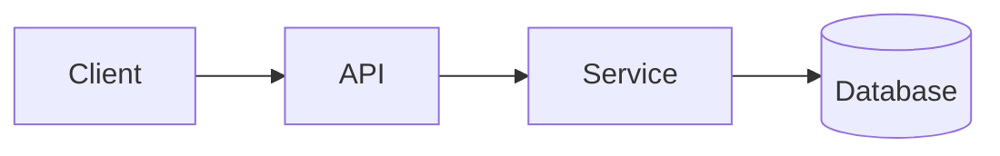

# Architecture overview

## High-level view

<!-- TODO(ai): replace with the real high-level diagram of this system. -->

## Components
- _Component A_ — _responsibility_
- _Component B_ — _responsibility_

## Tech choices
- Stack: typescript (strict TS)
- Frameworks: next, react

