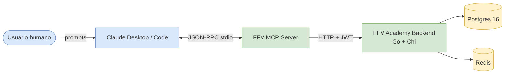
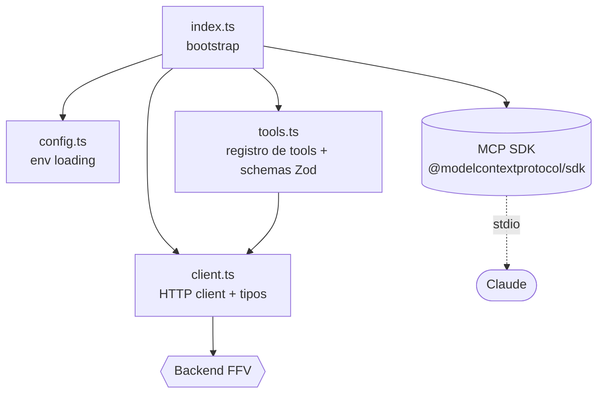
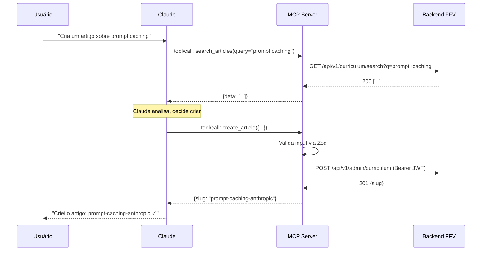
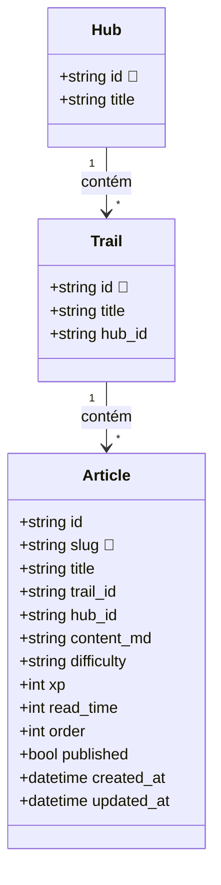
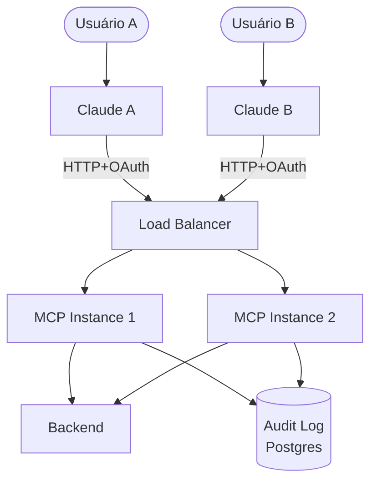

# 03 — Arquitetura

## Visão alto-nível

**Fronteiras de confiança:**

- `Usuário ↔ Claude`: confiável (mesmo humano).
- `Claude ↔ MCP`: confiável em uso solo, hostil em multi-user (v3+).
- `MCP ↔ Backend`: trust-on-first-use via JWT. Backend é a autoridade final (valida tudo).

---

## Componentes do MCP (organograma técnico)

**Responsabilidades por arquivo:**

| Arquivo | Responsabilidade única | NÃO faz |
|---|---|---|
| `index.ts` | Inicializar config + client + server, conectar transport stdio | Lógica de negócio, parsing de input |
| `config.ts` | Carregar env vars, validar tipos, fornecer defaults | Persistência, IO de rede |
| `client.ts` | Falar HTTP com o backend, mapear erros, expor tipos do domínio | Decisão sobre quando chamar (isso é da tool) |
| `tools.ts` | Definir schemas de input (Zod), registrar tools no MCP, formatar output | Lógica HTTP, parsing de env |

Esta separação importa porque ela permite **mockar `client.ts` em testes** sem subir o backend, e **trocar o transport** (stdio → HTTP) mexendo só no `index.ts`.

---

## Fluxo de uma chamada de tool

**Pontos críticos do fluxo:**

1. **Validação dupla:** Zod valida no MCP, backend valida no domain. Se passar no Zod e falhar no backend, é um bug de schema desincronizado.
2. **Idempotência:** o backend rejeita slugs duplicados (UNIQUE constraint). Logo `create_article` não é idempotente do lado do MCP — segunda chamada com mesmo slug retorna 409.
3. **Atomicidade:** cada tool = uma chamada HTTP. Não há transação multi-passo no MCP. Se uma tool precisa de 2 ops, isso vira 2 chamadas separadas — a falha entre elas é problema do LLM resolver.

---

## Modelo de dados (resumo do que o MCP toca)

**Estado da v0.1:** o MCP só conhece `Article`. `Trail` e `Hub` são strings opacas. v1.1 adiciona descoberta.

---

## Organograma de responsabilidades (RACI simplificado)

> Útil hoje (uso solo) e essencial quando alguém mais entrar.

| Atividade | Responsável | Aprovador | Consultado | Informado |
|---|---|---|---|---|
| Mudança em `tools.ts` (schema de input) | dev MCP | mantenedor | dev backend (se afeta API) | usuários |
| Mudança em endpoint do backend | dev backend | mantenedor | dev MCP | usuários |
| Liberação de release | mantenedor | — | dev MCP | usuários |
| Rotação de token admin | mantenedor | — | — | — |
| Resposta a incidente de segurança | mantenedor | — | dev MCP, dev backend | usuários |
| Adição de nova tool | dev MCP | mantenedor | dev backend | — |
| Decisão arquitetural (ADR) | proponente | mantenedor | dev MCP, dev backend | — |

Em uso solo, todos os papéis são você. Mas escrever isso explicitamente já estrutura como pensar quando alguém mais entrar.

---

## Decisões arquiteturais ativas (resumo, detalhes em `07-DECISIONS`)

| ID | Decisão | Status |
|---|---|---|
| ADR-001 | Linguagem: TypeScript + ESM | aceita |
| ADR-002 | Transport: stdio (single-user); HTTP fica pra v3 | aceita |
| ADR-003 | Auth: JWT Bearer estático em env (v1); refresh automático (v1.1); OAuth (v3) | aceita |
| ADR-004 | Cliente HTTP: escrito à mão (v1); gerado de OpenAPI (v2) | aceita |
| ADR-005 | Validação: Zod em tools, backend é a autoridade final | aceita |
| ADR-006 | Layout do código: 4 arquivos com responsabilidade única | aceita |
| ADR-007 | Tools de mutação em massa: rejeitadas | aceita |

---

## Limites de design conscientes

- **Não há cache.** Toda chamada vai pro backend. Aceitável em uso solo (latência baixa). v2 considera cache opcional.
- **Não há retry.** Backend retorna 5xx → tool falha. Aceitável; LLM pode tentar de novo. v2 adiciona backoff.
- **Não há queue.** Operações são síncronas. Não há "agendar criação pra mais tarde". Não precisa.
- **Não há webhook reverse.** Backend não notifica MCP de mudanças. MCP é pull-only. Adequado pro caso de uso.

---

## Interfaces externas (contratos)

### Com o backend FFV

- **Base URL:** definida via env `FFV_API_BASE_URL`.
- **Auth:** `Authorization: Bearer <jwt>`.
- **Versioning:** path `/api/v1/`. Mudança incompatível obrigaria `/api/v2/` no backend.
- **Erros:** RFC 7807 Problem+JSON. MCP parsea `title` e `detail` pra mensagem ao LLM.
- **Endpoints usados (v1):**
  - `GET /api/v1/curriculum`
  - `GET /api/v1/curriculum/search`
  - `GET /api/v1/curriculum/{slug}`
  - `POST /api/v1/admin/curriculum`
  - `PATCH /api/v1/admin/curriculum/{slug}`
  - `DELETE /api/v1/admin/curriculum/{slug}`

### Com o cliente MCP (Claude)

- **Protocolo:** MCP 2024-11-05 sobre stdio JSON-RPC 2.0.
- **Capabilities expostas:** `tools` (com `listChanged`).
- **Capabilities NÃO expostas (gap reconhecido):** `resources`, `prompts`, `sampling`, `logging`, `elicitation`. v2 adiciona resources + prompts; v2 ou v3 adiciona elicitation.

---

## Topologia futura (v3 multi-user)

Diferenças críticas vs v1:
- Stateless por instância (escala horizontal).
- Identidade do usuário propagada do OAuth pro backend (RBAC respeitado).
- Audit log compartilhado.
- Rate limit por usuário (Redis).

**Não construir até v3 ser justificada.** Documentado aqui só pra clarear pra onde a porta abre, se abrir.
