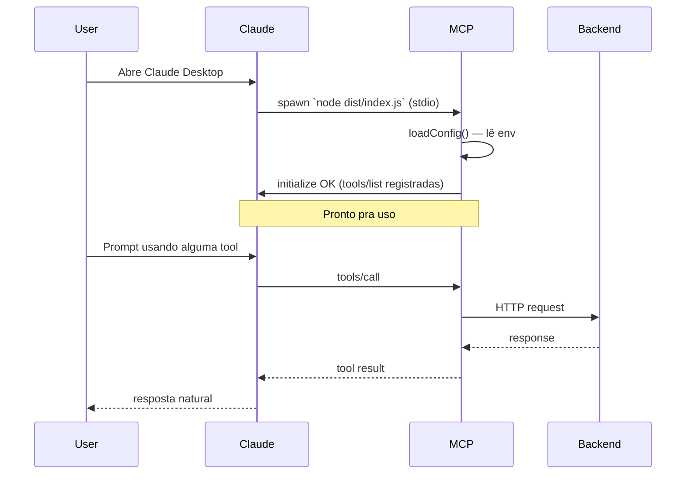

# 08 — Operações

Como rodar, monitorar, debugar e responder a incidentes.

---

## Modos de operação

### Dev local (uso atual)

- Backend FFV rodando em `localhost:8080` (`make dev` no `backend/`).
- MCP buildado em `mcp/dist/index.js`.
- Plugado no Claude Desktop / Code via config local.

**Fluxo de inicialização:**



### Produção (futuro v3)

- Servidor MCP hospedado.
- HTTP transport.
- OAuth.
- Métricas em Prometheus.

**Não documentado em detalhes — vive no roadmap v3.**

---

## Variáveis de ambiente

| Var | Obrigatória? | Default | O que faz |
|---|---|---|---|
| `FFV_API_BASE_URL` | não | `http://localhost:8080` | URL base do backend |
| `FFV_ADMIN_TOKEN` | não (somente pra mutations) | — | JWT com role=admin |
| `FFV_HTTP_TIMEOUT_MS` | não | `15000` | Timeout por request |

**v1.1 (planejado):**
- `FFV_REFRESH_TOKEN_PATH` — onde salvar refresh token (default `~/.config/ffv-mcp/credentials.json`).
- `FFV_MCP_DRY_RUN` — `1` desativa mutations (logam apenas).

---

## Comandos operacionais

### Verificar status (Claude Code)

```bash
claude mcp list
```

Esperado: `ffv-academy ✓ Connected`.

### Reiniciar MCP travado

```bash
claude mcp reset-server ffv-academy
```

### Inspecionar config

```bash
claude mcp get ffv-academy
```

### Smoke test sem Claude

```bash
cd /Users/fernandofranco/Developer/fernandofrancovalledotcom/mcp

# initialize
echo '{"jsonrpc":"2.0","id":1,"method":"initialize","params":{"protocolVersion":"2024-11-05","capabilities":{},"clientInfo":{"name":"smoke","version":"0"}}}' | node dist/index.js

# listar tools
( printf '%s\n' \
    '{"jsonrpc":"2.0","id":1,"method":"initialize","params":{"protocolVersion":"2024-11-05","capabilities":{},"clientInfo":{"name":"s","version":"0"}}}' \
    '{"jsonrpc":"2.0","method":"notifications/initialized"}' \
    '{"jsonrpc":"2.0","id":2,"method":"tools/list"}'
  sleep 0.3
) | node dist/index.js
```

### Rebuild

```bash
cd mcp
npm run build
```

E reinicie o cliente Claude pra recarregar.

---

## Observabilidade

### v1 (atual)

- **stderr:** linha única na inicialização (`[ffv-mcp] conectado. base=... admin=yes/no`).
- **Não tem:** logs estruturados, métricas, audit.

### v2 (planejado)

- **stderr JSON lines:**
  ```json
  {"ts":"2026-04-25T19:30:01Z","level":"info","tool":"list_articles","duration_ms":42,"status":"ok"}
  ```
- **Sanitização:** `Authorization`, `content_md` (resumido a length), email/phone sempre redactados.
- **Métricas (opcional):** se `OTEL_EXPORTER_OTLP_ENDPOINT` setado, exporta latência por tool e contagem de erro.

### Onde ler os logs

- **Claude Desktop:** stderr do MCP é capturado pelo cliente. Caminho macOS: `~/Library/Logs/Claude/mcp*.log`.
- **Claude Code:** `~/.claude/logs/mcp-ffv-academy.log` (verificar caminho exato com `claude mcp logs ffv-academy` se existir).

---

## Procedimentos operacionais (runbooks)

### RB-001 — Trocar/atualizar token admin (v1)

1. Gerar novo token via fluxo magic link:
   ```bash
   curl -X POST $BASE/api/v1/auth/request-token -H 'Content-Type: application/json' -d '{"email":"admin@..."}'
   # ler email/Mailhog → pegar 6 dígitos
   curl -X POST $BASE/api/v1/auth/verify -H 'Content-Type: application/json' -d '{"email":"admin@...","token":"123456"}'
   # copiar accessToken
   ```
2. Atualizar config do Claude:
   - **Desktop:** editar `~/Library/Application Support/Claude/claude_desktop_config.json`, campo `env.FFV_ADMIN_TOKEN`.
   - **Code:** `claude mcp remove ffv-academy && claude mcp add ffv-academy -e FFV_ADMIN_TOKEN=<novo> ... -- node ...`.
3. Reiniciar cliente Claude.
4. Verificar com `claude mcp list`.

> v1.1 elimina esse runbook — refresh fica automático.

### RB-002 — MCP não conecta (`✗ Failed`)

1. Inspecionar config: `claude mcp get ffv-academy`.
2. Rodar manualmente: `node /caminho/dist/index.js` no terminal.
3. Verificar erro em stderr.
4. Causas comuns:
   - Caminho do `dist/index.js` errado → corrigir.
   - Node ausente/versão errada → instalar Node ≥ 20.
   - `FFV_HTTP_TIMEOUT_MS` inválido → não passar ou passar número.
   - `dist/` não existe → `npm run build`.

### RB-003 — Tool retorna erro 401

1. Token expirado. Aplicar RB-001.
2. Se persistir após token novo, conferir que token tem `role=admin`:
   ```bash
   echo $TOKEN | cut -d. -f2 | base64 -d | jq
   ```
   Esperado: `"role": "admin"` no payload.
3. Conferir backend rodando: `curl $BASE/healthz`.

### RB-004 — Tool retorna 500

1. Olhar stderr do MCP — pode ter detail.
2. Olhar logs do backend (`docker logs ffv-api` ou equivalente).
3. Reproduzir via `curl` direto (sem MCP) pra isolar.
4. Se backend está OK e MCP falha, é bug do MCP — abrir issue.

### RB-005 — Reverter um `update_article` que estragou conteúdo

**Pré-condição:** backup do Postgres existe e foi testado (R-DATA-01).

1. Identificar slug e timestamp do estrago (audit log do backend: `GET /api/v1/admin/audit?action=update`).
2. Restaurar backup mais recente anterior ao estrago (procedimento do backend, não do MCP).
3. Re-executar mutations posteriores legítimas (se houver).

> Esse runbook é doloroso — por isso v1.1 R1.2 (preview) é prioritário.

### RB-006 — Resposta a incidente de segurança (token vazado)

1. **Imediato:** revogar todos os refresh tokens do user admin via `POST /api/v1/auth/logout-all` (autenticado).
2. Trocar JWT_SECRET do backend (invalida TODOS os tokens).
3. Reaplicar RB-001 com token novo.
4. Auditar `audit_log` por ações suspeitas no período de exposição.
5. Documentar incidente em `docs/incidents/YYYY-MM-DD.md`.

---

## Backup e DR

### O que precisa estar protegido

- **Banco do backend:** fonte da verdade dos artigos. Não é responsabilidade do MCP, mas é pré-requisito (R-DATA-01).
- **Config do MCP:** `~/.config/ffv-mcp/credentials.json` (v1.1+) — refresh token. Em vazamento, RB-006.
- **Código do MCP:** versionado em git, sem dado sensível.

### Restore

Procedimento de restore do backend é responsabilidade do backend (`backend/docs/operations.md` ou similar — verificar se existe). **Pré-requisito de qualquer mutation MCP em produção:** restore testado e cronometrado.

---

## Atualização (upgrade)

### Atualizar MCP (mantenedor)

```bash
cd mcp
git pull
npm install        # se package.json mudou
npm run build
# reiniciar Claude Desktop / claude mcp reset-server ffv-academy
```

### Política de breaking changes

- **v1.x → v2.0:** breaking permitido. CHANGELOG explícito.
- **v1.0 → v1.1:** sem breaking em config (env vars antigas continuam funcionando).
- **vX.Y → vX.Y.Z:** só fix.

---

## Capacidade e limites

| Recurso | Limite | Notas |
|---|---|---|
| Concorrência | 1 (stdio = 1 processo por sessão) | v3 muda |
| Throughput | limitado por backend (rate limit IP) | |
| Latência típica | < 500ms tool simples | depende do backend |
| Tamanho de `content_md` | 1MB (limite default Go) | backend não tem limite explícito ainda |
| Memória do processo | < 100MB típico | |
| Startup | < 200ms | |

---

## Onde pedir ajuda

- **Bugs no MCP:** abrir issue (quando virar repo público) ou anotar em `friction-log.md` (uso solo).
- **Bugs no backend visíveis pelo MCP:** issue no repo do backend (mesmo dono hoje).
- **Dúvidas sobre o protocolo MCP:** docs oficiais — https://modelcontextprotocol.io
- **SDK MCP:** GitHub do `@modelcontextprotocol/sdk`.

---

## Pós-incidente

Toda vez que algo quebra em uso real:

1. Anotar em `friction-log.md` no momento.
2. Se grave, criar `docs/incidents/YYYY-MM-DD-titulo.md` com timeline, causa, mitigação, ação preventiva.
3. Adicionar lição ao `01-CRITICAL-REVIEW` se for sistêmico.
4. Adicionar item ao `02-ROADMAP` se exigir mudança.
